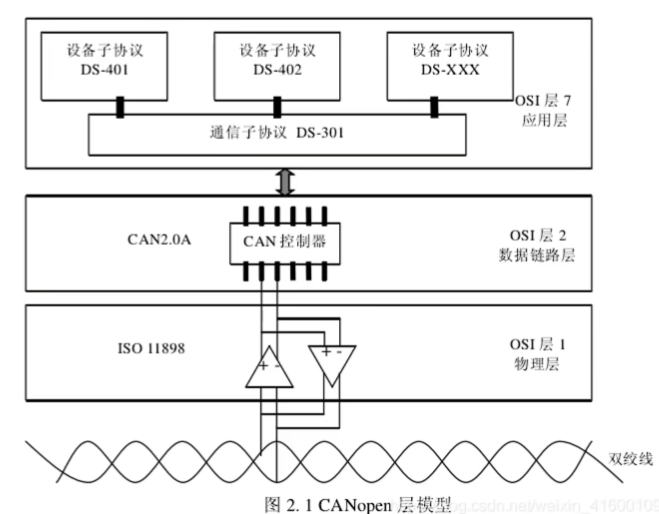
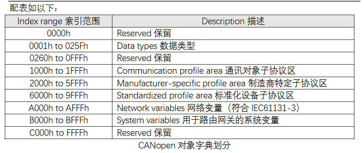
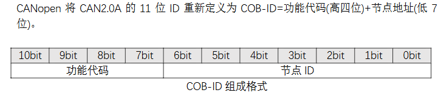
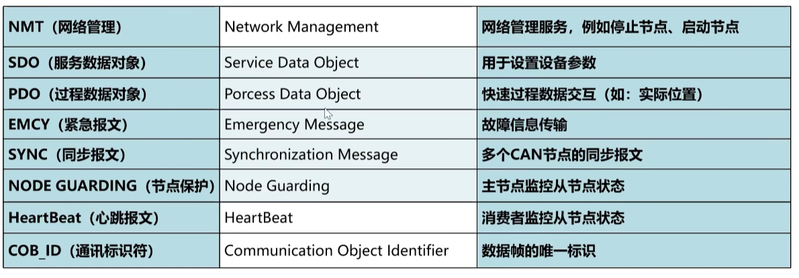
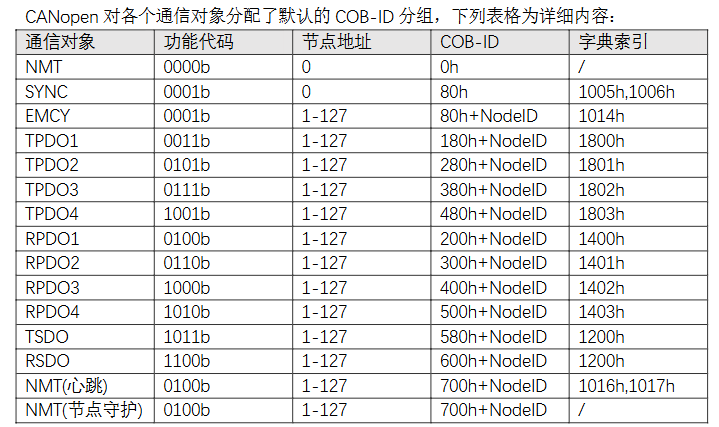

CANOPEN是基于CAL协议开发的，

CANOPEN免许可可免费使用

CANOPEN网络结构

## 对象字典

主要关注**通讯对象子协议区域、制造商特定子协议区、标准化设备子协议区**。

### 通讯对象子协议区域

包括设备类型、错误寄存器、支持的PDO数量、错误寄存器、PDO通信配置地址

### 制造商特定子协议区

### 标准化设备子协议区

不同设备功能定义大多都不一样，同样的设备功能是相同的，比如都是伺服设备，或者都是测量设备

## 通讯标识符

## 状态机

