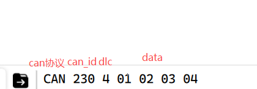
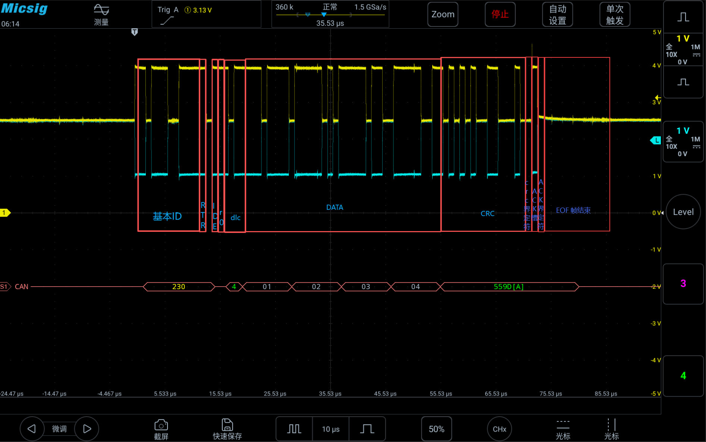
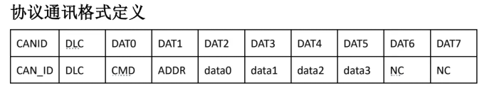
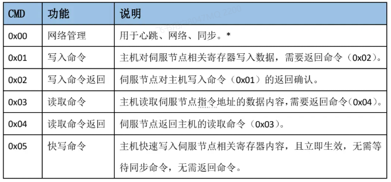

## 数据格式解读章节

### 串口发送CAN格式

CAN 230 4 01 02 03 04

这一串协议中

- CAN：代表这些数据走的是CAN协议
- 230：CAN_ID的值
- 4：dlc  数据长度
- 01 02 03 04：数据内容

### 示波器捕获标准CAN协议

## 电机通信相关章节

### PP系列电机协议解读（CAN）

- CAN_ID：基本ID0x01~0xff可用，0x00为广播
- DLC：CAN数据帧长度
- CMD：命令类型
- ADDR：指令地址，也可以理解为寄存器地址
- data0~data3：数据内容，大端模式（高位在前）

命令类型表：

指令地址：（部分）

比如  002 6 01 09 00 00 2A AA    这组CAN数据，输入这行命令就可以让电机以10RPM的速度旋转

解析下这组CAN命令   

002  就是要控制的CAN_ID

6   就是dlc位，表示发送数据为6位

01   根据命令类型表格可以知道是写入命令

09     根据协议指令表格得知是设置目标速度值

00 00 2A AA     即使10RPM转换后后的值

### CAN和CANOPEN的区别

简单来说 CAN只是规定了物理层和数据链路层，CANOPEN 在应用层进行了封装是基于CAL协议开发出来的。让不同厂商的 CAN 设备无需定制开发即可实现互联互通。

### PHU系列电机协议解读（PHU）

