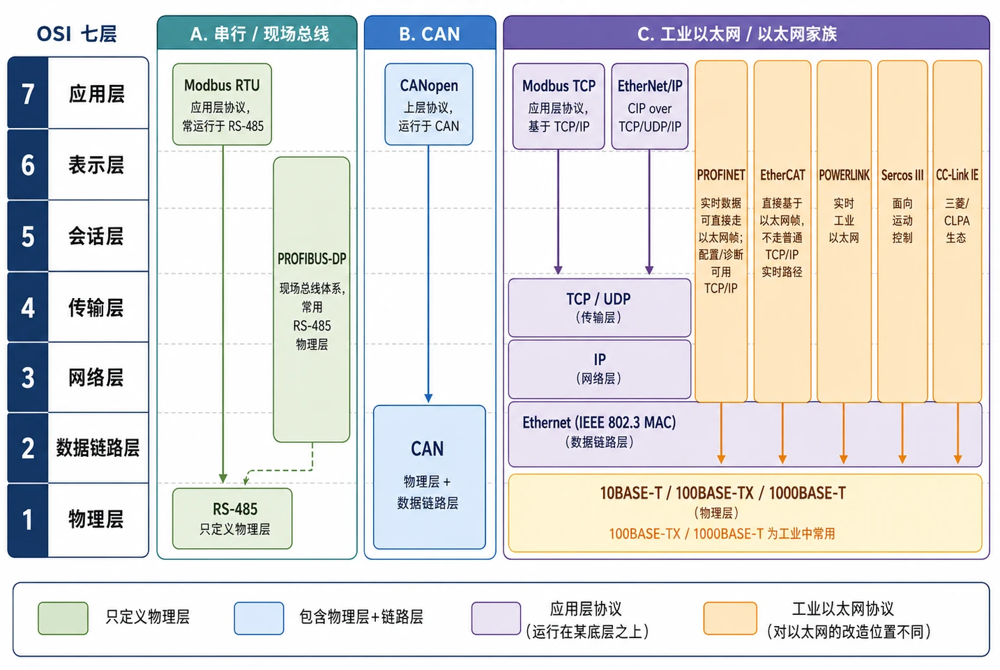
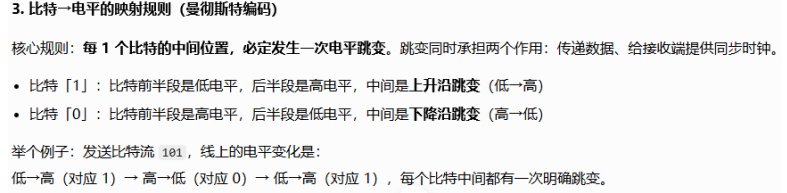
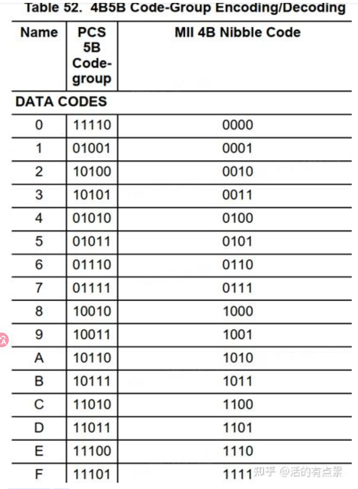
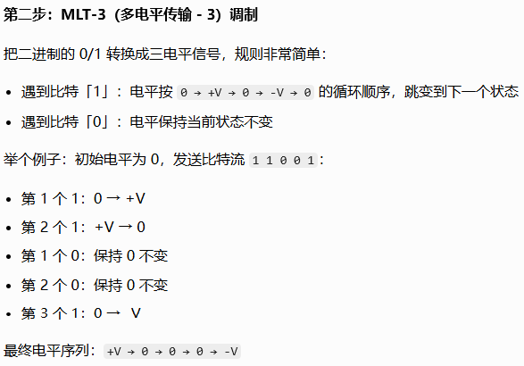
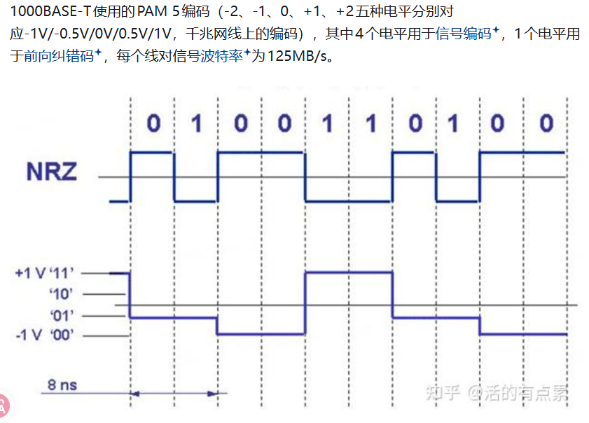

## A.串行/现场总线

### Modbus RTU

Modbus RTU缺少了数据链路层

这一层会规定 RTU 帧格式、CRC 校验、从站寻址、总线仲裁等链路层核心规则。

### PROFIBUS-DP

## B.CAN

没问题

## C.工业以太网/以太网家族

数据链路Ethernet（IEEE 802.3 MAC + IEEE 802.2 LLC）   这样写更标准

EtherCAT 3~6层没有覆盖

### 10BASE-T(10Mbps)

#### 接线使用

使用3类以上双绞线，4对双绞线中仅使用2对，收发分离

- 引脚1/2：发送（TX）
- 引脚3/6：接收（RX）
- 剩下两对（4/5、7/8）闲置，可用于PoE供电或者低速辅助信号

#### 电平定义

高电平：Vdiff=+2.5v（TX+>TX-）
低电平：Vdiff=-2.5v（TX+<TX-）

编码方式使用曼彻斯特编码

### 100BASE-TX(100Mbps)

#### 接线使用

使用5类以上双绞线，4对双绞线中仅使用2对，收发分离

- 引脚1/2：发送（TX）
- 引脚3/6：接收（RX）

#### 电平定义

正高电平：Vdiff=+1.0v（TX+>TX-）
正低电平：Vdiff=-1.0v（TX+<TX-）

编码方式改为4B/5B编码

把每4个连续的二进制比特，映射成5个比特的编码组。既保证码流中不会出现连续过多的0，也避免长连0导致接收端失步。编码后速率从100Mbps变成125Mbps。参考如下：

遇到1就变换电平，遇到0就保持电平

### 1000BASE-TX(1000Mbps)

#### 接线使用

使用5类以上双绞线，4对双绞线全部使用，并且每一对都处在双向全双工模式（同一对线同时发送和接收数）

- 四队线全部用于收发数据

#### 电平定义

+2级：Vdiff=+1.0v
+1级：Vdiff=+0.5v
0级：Vdiff=0v
-1级：Vdiff=-0.5v
-2级：Vdiff=-1.0v

每个电平代表一个符号，单个符号最高可承载2bit信息

编码方式改用4D-PAM5（四维五电平脉冲幅度调制）

