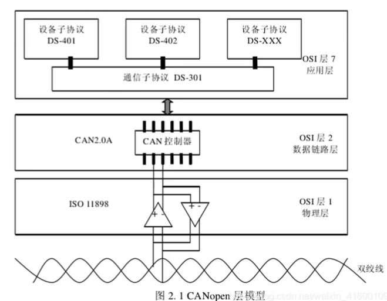
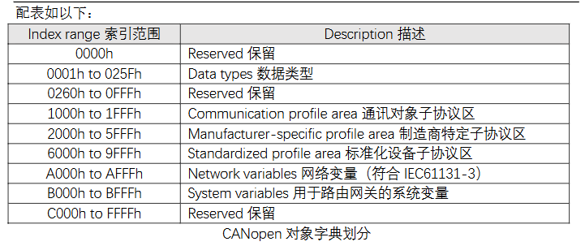
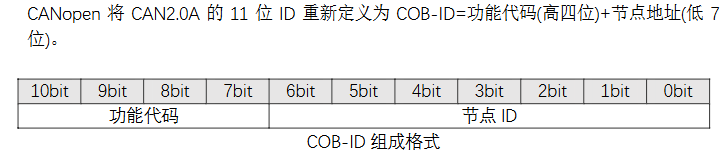
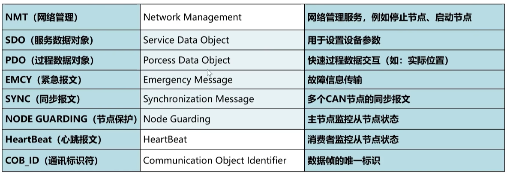
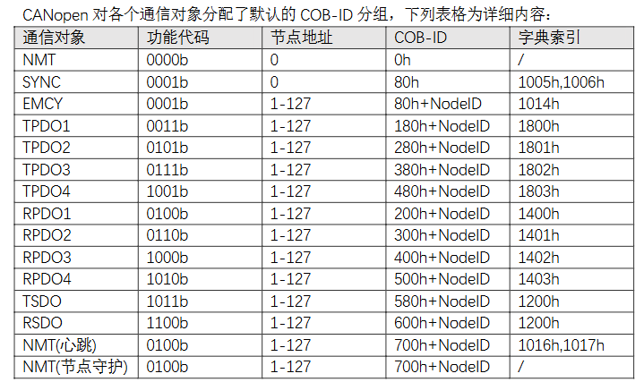
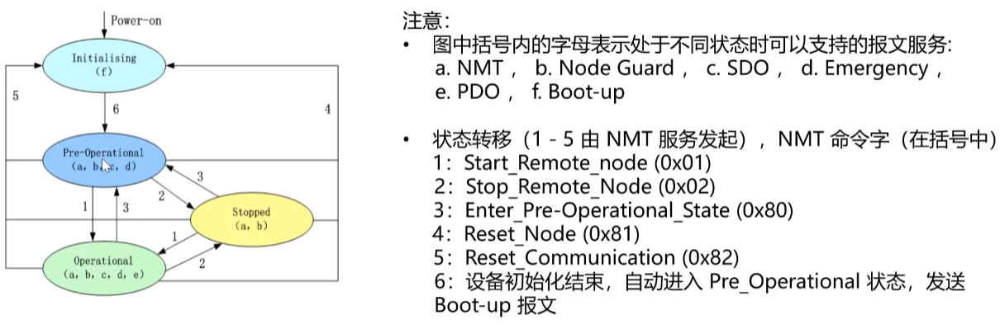
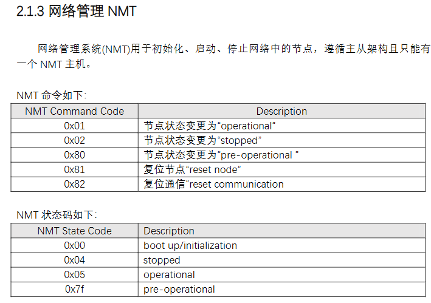
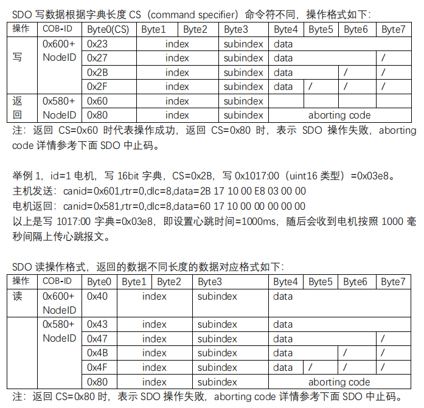

CANOPEN是基于CAL协议开发的，

CANOPEN免许可，可免费使用

CANOPEN网络结构

## 对象字典

主要关注**通讯对象子协议区域、制造商特定子协议区、标准化设备子协议区**。

### 通讯对象子协议区域

包括设备类型、错误寄存器、支持的PDO数量、错误寄存器、PDO通信配置地址等

### 制造商特定子协议区

是CANOPEN对象字典的核心固定分区，也是不同厂商实现设备差异化主要地方

### 标准化设备子协议区

不同设备功能定义大多都不一样，同样的设备功能是相同的，比如都是伺服设备，或者都是测量设备

## 通讯标识符

报文类型

## 状态机

通过网络管理NMT切换状态

## SDO通讯     服务数据对象

发送低优先级的对象，比如修改pid参数，修改PDO配置参数

## PDO通讯     过程数据对象

用来传输实时生成的数据，需要地址映射，没研究

## 同步对象（SYNC）

实现网络节点时间同步的广播通信对象

## 紧急对象（EMCY）

节点内部出现致命错误时主动发送的告警报文

## 网络守护（心跳与节点保护）

NMT网络管理对总线上节点状态和保障通信的功能，心跳是节点周期性得广播自身状态，节点保护是主站对从站的状态监控。

