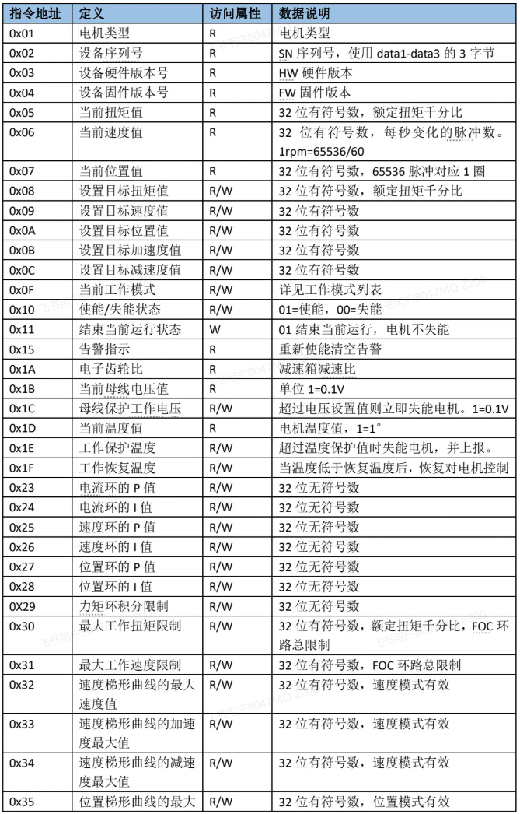
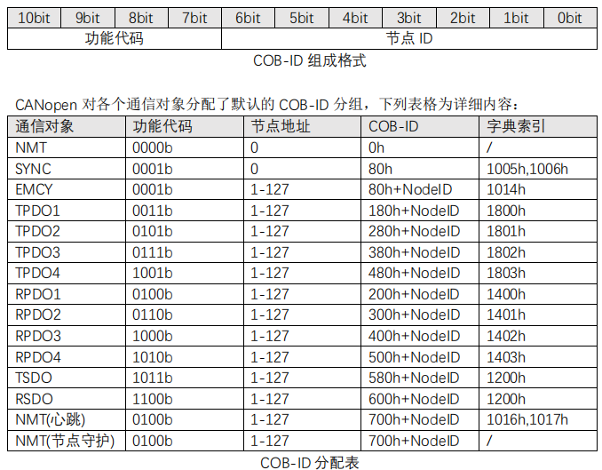
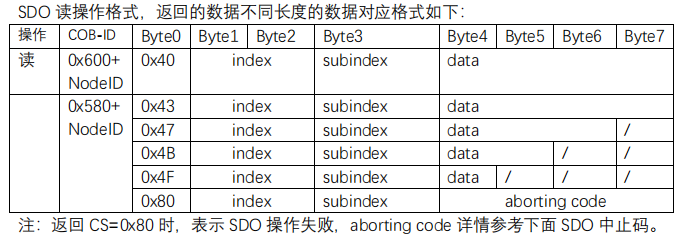
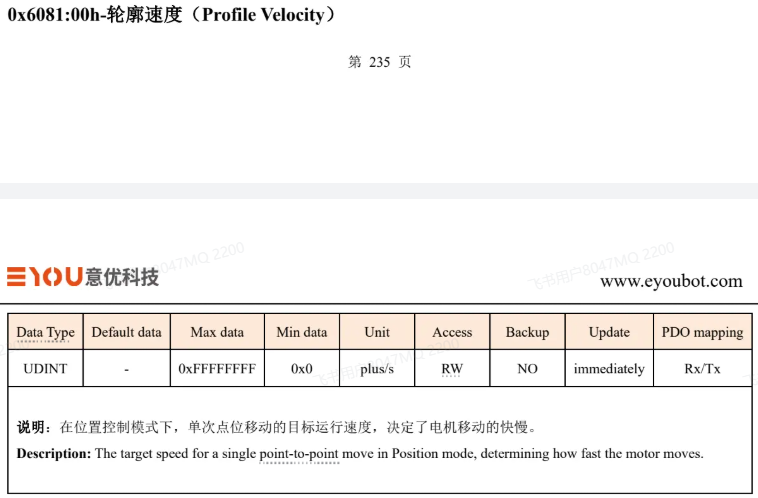

## 数据格式解读章节

### 串口发送CAN格式

CAN 230 4 01 02 03 04

这一串协议中

- CAN：代表这些数据走的是CAN协议
- 230：CAN_ID的值
- 4：dlc  数据长度
- 01 02 03 04：数据内容

### 示波器捕获标准CAN协议

## 电机通信相关章节

### PP系列电机协议解读（CAN）

- CAN_ID：基本ID0x01~0xff可用，0x00为广播
- DLC：CAN数据帧长度
- CMD：命令类型
- ADDR：指令地址，也可以理解为寄存器地址
- data0~data3：数据内容，大端模式（高位在前）

命令类型表：

指令地址：（部分）

比如  002 6 01 09 00 00 2A AA    这组CAN数据，输入这行命令就可以让电机以10RPM的速度旋转

解析下这组CAN命令   

002  就是要控制的CAN_ID

6   就是dlc位，表示发送数据为6位

01   根据命令类型表格可以知道是写入命令

09     根据协议指令表格得知是设置目标速度值

00 00 2A AA     即使10RPM转换后后的值

### CAN和CANOPEN的区别

简单来说 CAN只是规定了物理层和数据链路层，CANOPEN 不仅包括这些还完整定义了传输层、网络层、应用层的规范，让不同厂商的 CAN 设备无需定制开发即可实现互联互通，CANOPEN基于CAL协议开发而来的。

CANOPEN文档在上一级目录下

### PHU系列电机协议解读（CANOPEN）

CANOPEN的报文和普通CAN的报文在格式上是一样的，不同的是一些字节上的定义。

以下面这条报文为例

我们可以看到三个数据 

- 601h   基本ID
- 8         DLC
- 23 81 60 00 55 D5 10 00     数据位

其中601是通信表示符也叫COB-ID,格式以及分配表可参考下图。

我们把601拆解下，可以理解成600h+1h，其中600h是RSDO通信对象的指令，1就是电机id。

8 即dlc位，代表数据长度

23 81 60 00 55 D5 10 00   这一串是数据位

而这一串数据位的含义就要找到对应的通信对象章节中报文格式了。

从ID位我们知道我们的通信对象是RSDO，参考SDO的报文格式我们就可以对数据进行解析了。

其中Byte0位是数据长度命令，Byte1和Byte2共同组成了索引地址(小端模式，低位在前)，Byte3是索引地址的子地址，Byte4~Byte7是数据位（小端模式），这里就是我们要填的数据了。

查看下图，这个就是我们这个命令填入的索引地址。

从左上角看它的索引地址四0x6081，子索引地址是00，

通过解读数据我们可以得到以下信息，

- 23    4数据位的操作符
- 81 60     索引地址0x6081
- 00    子索引地址0x00
- 55 D5 10 00    要填入的地址数据

有了这些我们就可以发送简单的命令了。

第一个是起始位，默认为0，然后接下去是11位的ID，刚才发送的是0x230，这边解析出来也是0x230，
23003
xxxxxxxxxx此处解读标准can帧。

CAN帧
0 230 0 0 0 5 18 42 28 54 13 CRC 1 0 1 7F

第一个是起始位，默认为0，然后接下去是仲裁段，包含11位的ID和RTR位，刚才发送的是0x230，这边解析出来也是0x230，RTR判断位，用来判断这一帧数据是数据帧还是遥控帧，

