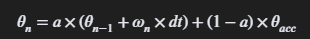
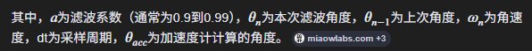

## 初始化代码解读

在初始化时一般要做这几件事情，

	1、初始化I2C总线
	2、唤醒芯片并设置时钟源
	3、设置采样频率
	4、配置低通滤波器（可选）
	5、配置陀螺仪和加速度计量程

之后我们就可以取读取原始数据了，

读取原始数据的方法也有两种

	1、从0X3B开始按顺序读取寄存器的值
	2、从fifo缓存中读取数据

从fifo缓冲区读数据也有两种常用的方法

	1、读取0X72数据看fifo中是否记录了所需数据，检查数量满足后，再去读取
	2、通过配置中断引脚，当fifo中数据转换完成后，触发中断，mcu再去读取数据

通过这些方法都可以获取到三轴的陀螺仪数据和加速度数据

## 拿到原始数据后可以做什么

### 陀螺仪原始数据

运动唤醒操作、倾倒碰撞检测、体感手势识别、体感游戏的控制器（赛车、FPS辅助瞄准）、防抖前馈控制、转向控制中加入角速度环、短时间内的相对角度控制

### 加速度计原始数据

加速度计的数据不适合运用在高频动态的场景中。

振动跌落倾倒检测、敲击检测、体感手势识别、跳绳深蹲等运动的计数、过载异常等安全保护（小车急刹ABS抱死，电梯下降异常）、静态角度或平衡状态检测、坡度检测、短时间的速度和相对位移的计算。

## IMU性能参数

### 核心参数
量程
零偏
温偏
带宽
噪声密度

## 误差

### 陀螺仪

#### 偏置误差

陀螺仪本体在静止时采集到的误差。

##### 如何处理

通过上机后连续采样300-500个数据进行平均计算得出平均误差值，在每一次采集时都减去这个值就可以得到真实的数据了

#### 敏感度误差

### 加速度计

#### 偏置误差

陀螺仪本体在静止时采集到的误差。

##### 如何处理

同陀螺仪

#### 敏感度误差

## 滤波

一般是根据使用场景来决定是否对数据进行滤波处理

实时性强、精度要求高、会用到数据积分的场景，都必须要滤波。

校准、存在大量干扰源的、大幅度动作检测的场景，尽量滤波，不做处理也可以用，但效果不好

阈值触发，大幅度超过干扰值的判定来使用的场景，可不做滤波处理。

### 卡尔曼

用经验值推测下一个值，再与实际测量值相结合得到最总得数据

## 姿态融合算法

将两个或多个传感器数据结合以增加数据的可信度，使用这种方式的算法都可以理解为融合算法。

### 一阶互补滤波

最简单的融合算法，其算法只有加法和乘法，也只有一个参数用于调节，简单易用。

核心公式如下图所示

其核心在于滤波系数上我们一般会将加速度反正切后得到其角度数据，因为加速度会受到振动等高频干扰的影响，所以我们不相信它的瞬时变换数据，而陀螺仪天生存在零偏问题，哪怕处于静止状态也会有一个很小的值在输出，随着时间的累积，误差会不断放大，而高通滤波的规则是不相信长期、慢变得偏差数据，随着时间得推移，很久之前得零偏数据的权重就被衰减到无线接近于零了，使它不会一直累积下去。

对于加速度计我们会相信它持续的输入状态，所以我们要保留缓慢变化的数据，滤掉快速变化的数据，可以理解为我们对加速度计数据要进行低通滤波处理。

对于陀螺仪因为有零偏的存在，所有的错误数据会因为积分作用一直存在于数据中，为减小历史数据的影响，我们更相信短期数据，可以理解为我们对陀螺仪数据要进行高通滤波的处理

一阶互补滤波器帮我们解决了角度漂移的问题，但它自身还有很多问题没有解决，比如：不同的场景需要不用的参数调试，没有修正陀螺仪零飘的问题，万向节死锁问题等等。

### Mahony 滤波器

有点复杂的一个滤波器，中间涉及到欧拉角，四元数等内容，这些可参考另一个文档。

而Mahony滤波器，是怎么处理数据的呢。

1、对原始数据预处理，初始化校准零偏值，归一化处理加速度计，

2、对陀螺仪测量到的角速度值进行分解得到四元数的值

3、通过叉乘计算出误差角度，来修正陀螺仪的角速度。

4、知道了误差角度后，使用PI控制器来修正陀螺仪偏置

5、最后就是更新四元数，再对四元数归一化处理。

## 附录

[扩展卡尔曼、Madgwick、Mahony对比](https://web.cs.ndsu.nodak.edu/~siludwig/Publish/papers/ICUAS2018.pdf)

[敏感度误差测量项目](https://github.com/xioTechnologies/Calibration-Cube)

