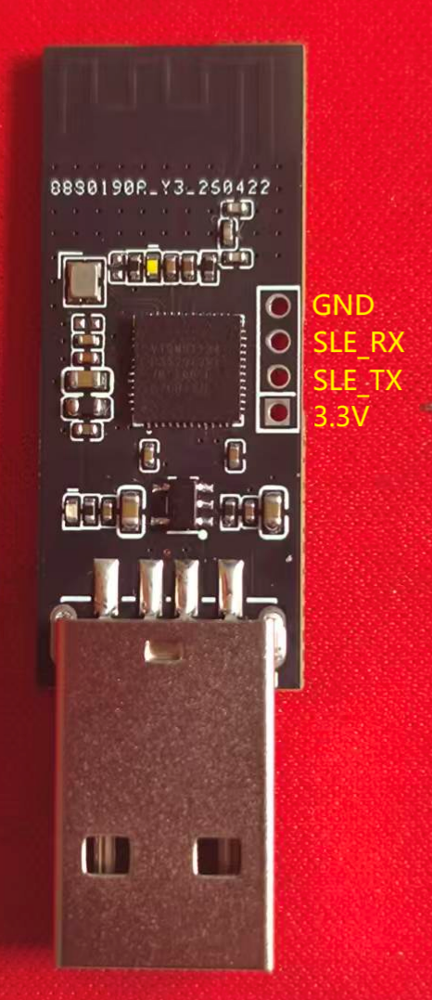
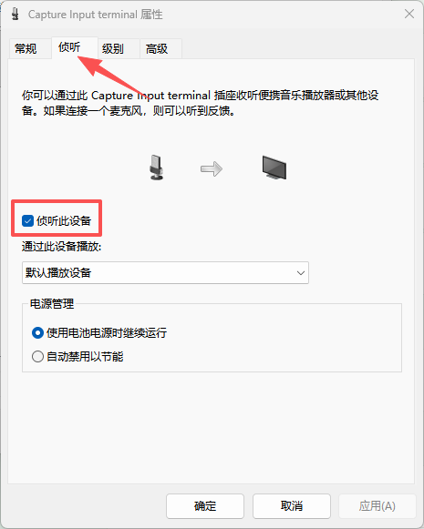
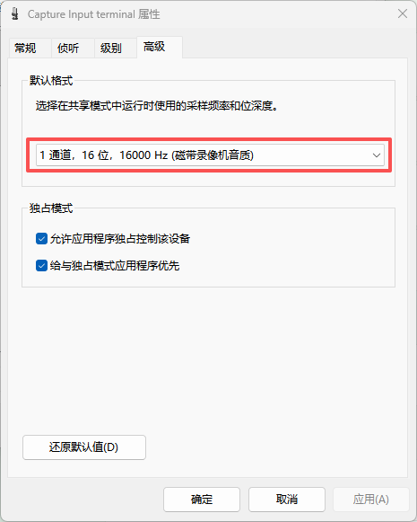

## 模组介绍

Hisi 无线收发模块是一个基于BS21e的案例，模组分为发送和接收，发送模块可以无线传输音频数据和收发UART串口数据，接收模块可在PC上模拟出音频输入设备和USB-HID键盘设备。

### 接收模块


#### 核心功能

- 通过星闪接收发送端传输的音频数据和键盘指令。
- 解析音频数据通过 USB 音频接口实时传输给 PC。
- 将键盘指令通过 USB-HID 接口发送给 PC。

#### 下载电路连接

下载电路接口信息如下



使用串口调试模块按以下方式连接

```
串口调试模块           接收模块
3.3V-----------------3.3V
TX-------------------SLE_RX
RX-------------------SLE_TX
GND------------------GND
```


### 发送模块


#### 核心功能

- 实时采集PDM数字麦克风数据，并发送给接收模块。
- 通过UART接口和外部通信。
- 解析JSON格式的claude code状态反馈。
- 接收并转发键盘码指令给接收模块。

#### 外设选择

麦克风：建议选用型号为**MSM261D4030H1CPM**。

UART接口：使用任意可UART通信的单片机即可，**波特率**默认配置为**115200**。


## 固件烧录

1、下载烧录工具

- 下载[BurnTool](https://gitee.com/hihope_iot/near-link/blob/master/tools/BurnTool_5.0.39.rar)工具
- 下载完成后打开BurnTool压缩包

2、进入BurnTool，点击“Setting”，波特率设置为750000。


3、选择端口，选择固件，并勾选“Auto burn”和“Auto disconnect”。


4、点击Connect，断开开发板连接的供电线，再重新连接开发板供电线，即可烧录固件。


## PC端音频设备配置

先将接收模块插入PC的任意USB-A口。

首先我们打开**设置**（快捷键win+i），进入系统->声音->高级->更多声音设置


在弹出的窗口中我们在最上面一栏中点击**录制**，在设备列表中找到带有**Audio-HID**的设备右键选择**属性**。

在弹出的窗口的最上面一栏选择侦听，勾选**侦听此设备**。



之后再进入到**高级**一栏中。选择默认格式为“**1通道，16位，16000HZ（磁带录像机音质）**”。



点击应用再点击确定即可。

至此PC端音频设备配置就完成了。

## 键盘码指令如何发送

首先我们要搞懂键盘码的指令格式是什么样的，它是由一个9个字节数据组成的一串报文，根据下面的表格就可以清楚了解键盘码的指令格式。


| 字节索引 | 16进制值 | 含义                         |
| ---- | ----- | -------------------------- |
| 0    | 0x01  | Report ID位，标识这是1号键盘的报告     |
| 1    | 0x00  | 修饰键描述位，比如Ctrl/Shift/Alt等键位 |
| 2    | 0x00  | 协议保留位，默认为0x00              |
| 3~8  | 0x0A  | 普通按键键码位，最多可同时上报6个普通按键键值    |

知道了指令格式后就可以编写代码来自定义按键输出了。

```
Tip：我们发送的不是字符串数据，我们要发送的是字符数据。
```

例如，我们可以创建一个数组将键码指令放进去，每次只用发送按个数据就可以了

```
// Alt+A组合键
const uint8_t keyPressData[] = {0x01, 0x04, 0x00, 0x0A, 0x00, 0x00, 0x00, 0x00, 0x00};
//串口发送Alt+A组合键
Serial.write(keyPressData, sizeof(keyPressData));
```


Tip：在每次发送结束后我们还需要发送结束指令，结束指令的格式数据如下：

```
const uint8_t keyReleaseData[] = {0x00, 0x00, 0x00, 0x00, 0x00, 0x00, 0x00, 0x00, 0x00};
```

我们要结束字符发送时都要发送结束指令，不然PC会认为我们还在按下按键。

## 接收HID下发的数据


