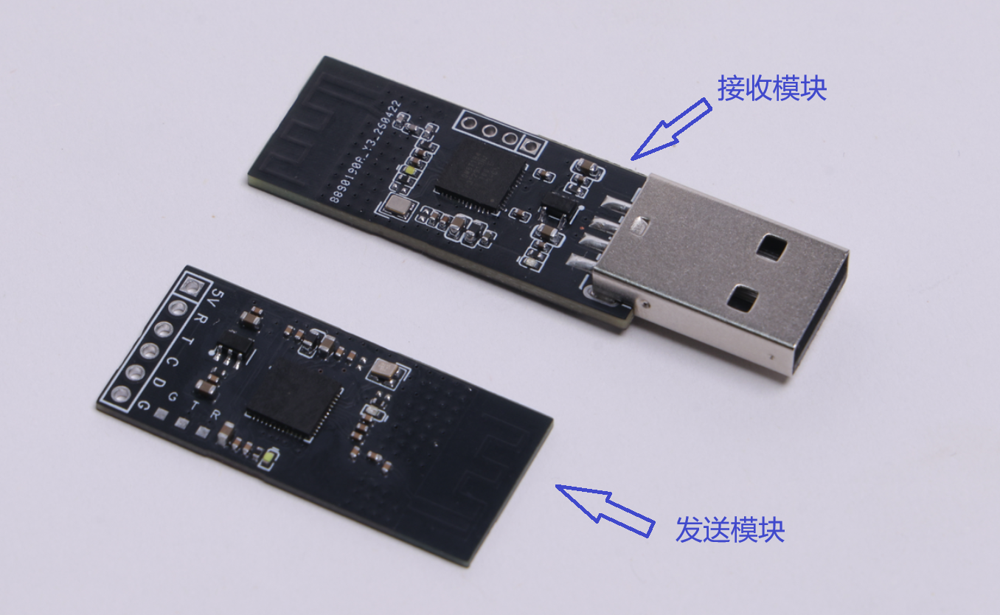
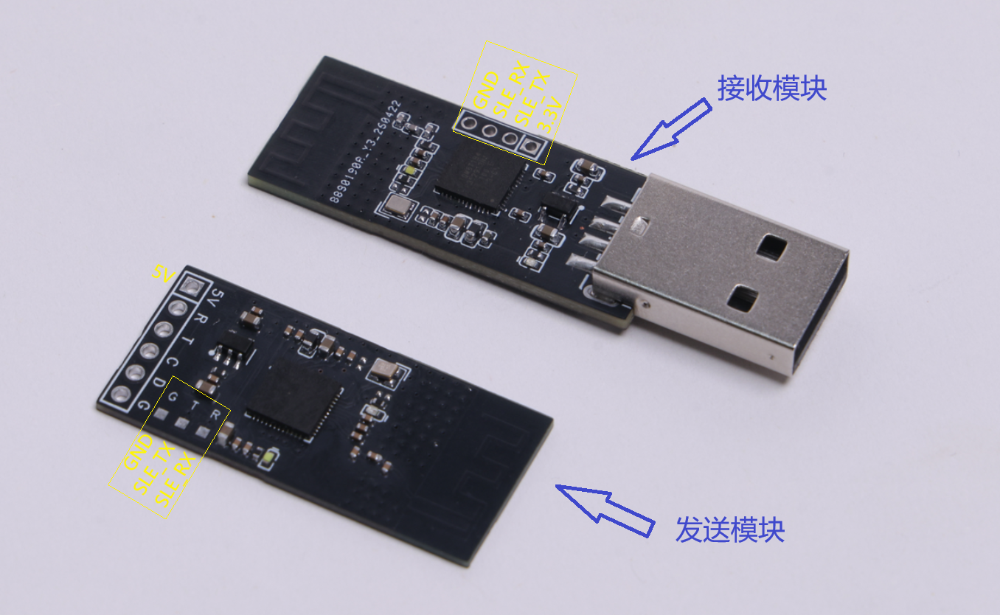
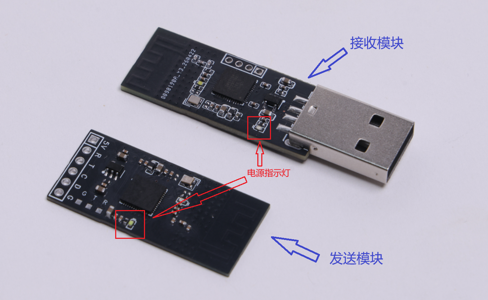
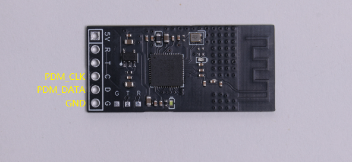
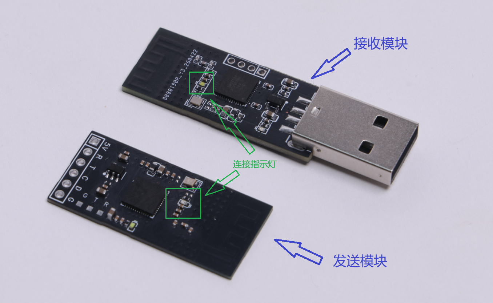
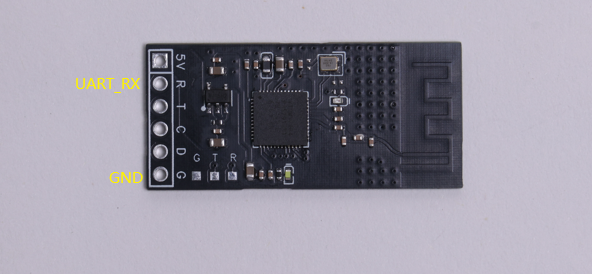
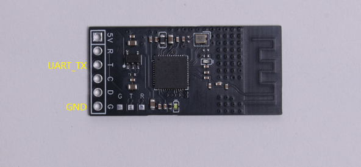
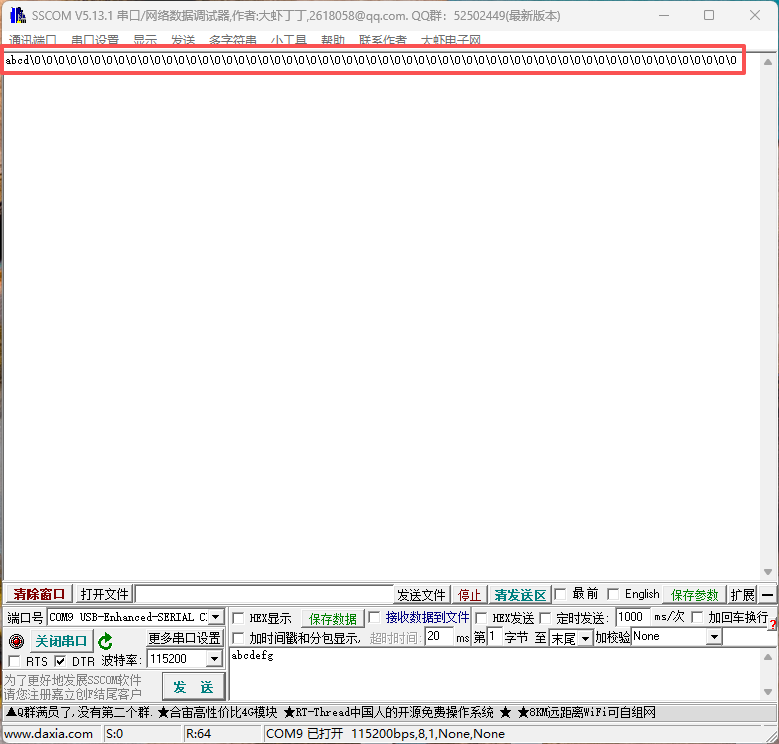
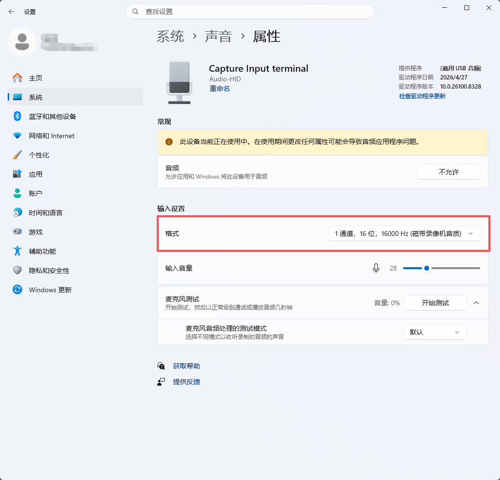

## 模组介绍

Hisi 无线收发模块是一个基于BS21e的案例，模组分为发送和接收，发送模块可以无线传输音频数据和收发UART串口数据，接收模块可在PC上模拟出音频输入设备和USB-HID键盘设备。



#### 核心功能

- 实时采集 PDM 数字麦克风音频数据，接收并转发键盘指令，通过星闪将音频数据与键盘码指令同步发送至接收模块。
- 通过星闪接收发送端传输的音频数据和键盘指令，完成数据解析后，将音频数据和键盘指令通过 USB 接口实时传输给 PC。
- 通过 USB-HID 接收电脑下发的数据，配合整体链路完成双向数据通信

#### 外设选择

麦克风：推荐选用型号为**MSM261D4030H1CPM**。

UART接口：使用任意可UART通信的单片机即可，**波特率**默认配置为**115200**。

## 固件烧录

### 硬件连接




使用下载调试模块按以下接线方式分别与接收模块和发送模块连接。

```
串口调试模块           接收模块
3.3V-----------------3.3V
TX-------------------SLE_RX
RX-------------------SLE_TX
GND------------------GND
串口调试模块           发送模块
5V-------------------5V
TX-------------------SLE_RX
RX-------------------SLE_TX
GND------------------GND
```

### 软件烧录

1、下载烧录工具

- 下载[BurnTool](https://gitee.com/hihope_iot/near-link/blob/master/tools/BurnTool_5.0.39.rar)工具。
- 下载完成后解压BurnTool压缩包。

2、进入BurnTool，点击“Setting”，波特率设置为750000。


3、选择端口，选择固件，并勾选“Auto burn”和“Auto disconnect”。


4、点击Connect，断开开发板连接的供电线，再重新连接开发板供电线，即可烧录固件。


## 功能调试

先将接收模块插入PC的任意USB-A口，接收模块也对应接好5V电源，可看到下图标记位置的**电源指示灯**亮起。



打开电脑的设备管理器，在键盘一栏可以看到有增加一个HID Keyboard Device，在音频输入和输出一栏中有增加Audio-HID结尾的麦克风和扬声器，表示接收端设备已成功在PC上模拟出了HID设备，新增如下图所示。


### PC端音频设备配置



按以下接线，连接麦克风模块。
```
麦克风模块             发送模块
CLK-------------------PDM_CLK
DAT-------------------PDM_DATA
GDN-------------------GND
```

连接完成后，我们回到PC端。

首先我们打开**设置**（快捷键win+i），进入系统->声音->高级->更多声音设置


在弹出的窗口中我们在最上面一栏中点击**录制**，在设备列表中找到带有**Audio-HID**的设备右键选择**属性**。

在弹出的窗口的最上面一栏选择侦听，勾选**侦听此设备**。


之后再进入到**高级**一栏中。选择默认格式为“**1通道，16位，16000HZ（磁带录像机音质）**”。


点击应用再点击确定即可。

回到先前声音设置界面，我们对麦克风说话可以看到音量条有明显的跳动，代表麦克风接入正常。

这时我们回到板子上，可以观察到下图所示的这两个**连接指示灯**应该有亮起，代表这两块板子连接成功了。



至此PC端音频设备配置就完成了。

### 键盘码指令的发送



按以下接线方式，连接带UART功能的MCU或模块。

```
MCU                   发送模块
TXD-------------------UART_RX
GND-------------------GND
```

首先我们要搞懂键盘码的指令格式是什么样的，它是由一个9个字节数据组成的一串报文，根据下面的表格就可以清楚了解键盘码的指令格式。

| 字节索引 | 16进制值 | 含义                         |
| ---- | ----- | -------------------------- |
| 0    | 0x01  | Report ID位，标识这是1号键盘的报告     |
| 1    | 0x00  | 修饰键描述位，比如Ctrl/Shift/Alt等键位 |
| 2    | 0x00  | 协议保留位，默认为0x00              |
| 3~8  | 0x0A  | 普通按键键码位，最多可同时上报6个普通按键键值    |

知道了指令格式后就可以编写代码来自定义按键输出了。

```
Tip：我们发送的不是字符串数据，我们要发送的是字符数据。
```

例如，我们可以创建一个数组将键码指令放进去，每次只用发送这个数组就可以了

```
// Alt+a组合键
const uint8_t keyPressData[] = {0x01, 0x04, 0x00, 0x04, 0x00, 0x00, 0x00, 0x00, 0x00};
//串口发送Alt+a组合键
Serial.write(keyPressData, sizeof(keyPressData));
```


在每次发送结束后我们还需要发送结束指令，结束指令的格式数据如下：

```
const uint8_t keyReleaseData[] = {0x00, 0x00, 0x00, 0x00, 0x00, 0x00, 0x00, 0x00, 0x00};
```

我们在每次发送完键码指令后都要发送结束指令，不然PC会认为我们还在按下按键。

### 接收HID下发的数据



按以下接线方式，连接带UART功能的MCU或模块。

```
MCU                   发送模块
RXD-------------------UART_TX
GND-------------------GND
```

连接完成后，我们回到PC端。

使用**HIDAssist**工具快速验证模块间的通信测试。

1、下载[HIDAssist](https://www.wch.cn/downloads/HIDAssist_ZIP.html)工具，并解压，压缩包内有详细的使用说明。

2、打开HIDAssist工具，点击设备列表，找到如下所示的设备，并连接设备。


3、在发送区输入自定义内容，点击发送。

4、回到串口助手，我们可以看到，我们接收到了刚刚发送的内容。




## 调试建议

### 连接指示led灯未亮

- 检查供电led是否亮起，确保供电无异常。
- 在PC端，打开设置，进入系统->声音->输入，点击**Audio-HID**，检查输入设置中的格式是否设置正确。



