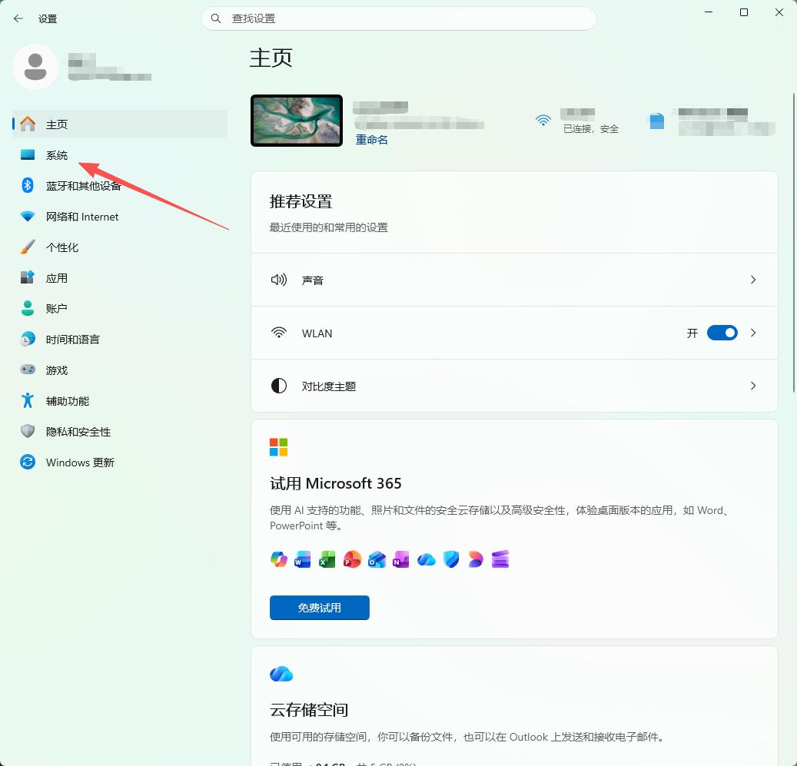
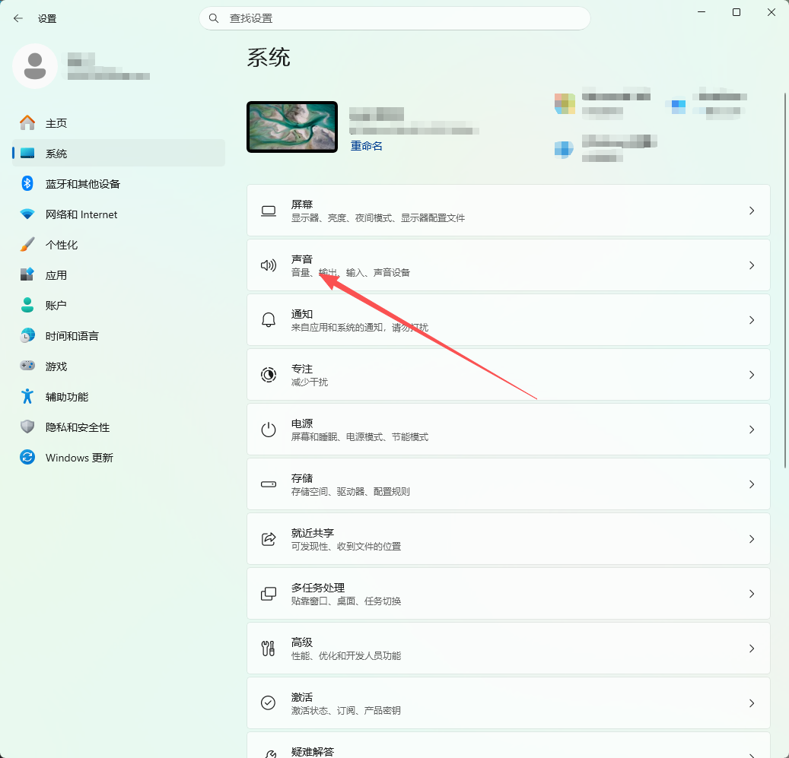
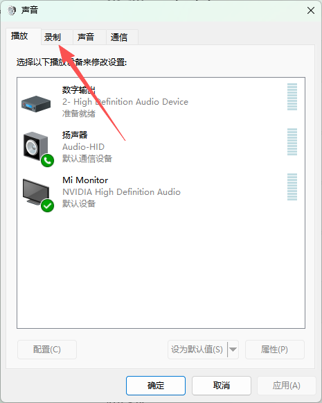
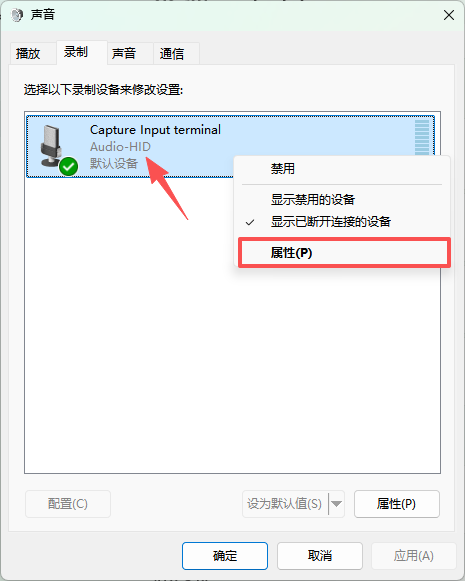
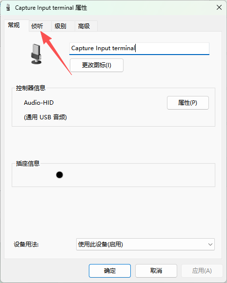
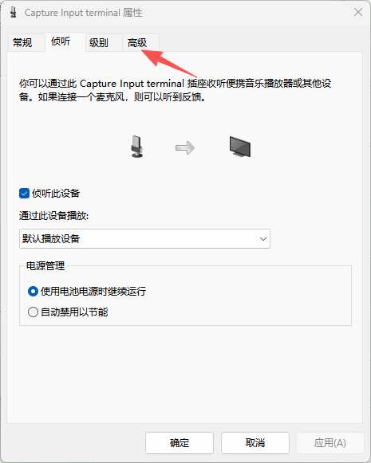
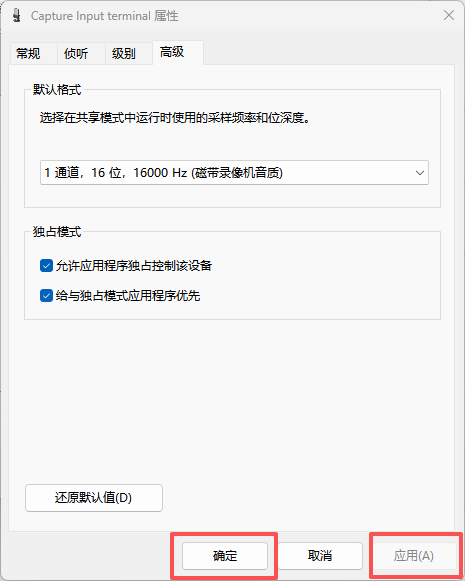

## 模组介绍

该模组是基于星闪无线通信技术的传输模组，模组分为发送和接收，发送模块可以无线传输音频数据和收发UART串口数据，接收模块可在PC上模拟出音频输入设备和USB-HID键盘设备。

### 接收模块

#### 核心功能

- 通过星闪接收发送端传输的音频数据和键盘指令
- 解析音频数据通过 USB 音频接口实时传输给 PC
- 将键盘指令通过 USB-HID 接口发送给 PC，可实现无线键盘功能

### 发送模块

#### 核心功能

- 实时采集PDM数字麦克风数据，并发送给接收模块
- 通过UART接口和外部通信，
- 解析JSON格式的claude code状态反馈
- 接收并转发键盘码指令给接收模块

## 

### PC端音频设备配置

先将接收模块插入PC的任意USB-A口。

首先我们打开**设置**（快捷键win+i），进入**系统**栏。

进入**声音**栏内

在声音栏中找到**高级**选项，**点击更多声音设置**

在弹出的窗口中我们在最上面一栏中点击**录制**

在设备列表中找到带有**Audio-HID**的设备右键选择**属性**。

在弹出的窗口的最上面一栏选择侦听

勾选**侦听此设备**

之后再进入到**高级**一栏中。

选择默认格式为“**1通道，16位，16000HZ（磁带录像机音质）**”，可能括号里的内容有所不同，主要确定前面的数据格式即可。

点击应用再点击确定即可。

至此PC端音频设备配置就完成了。

## 键盘码指令如何发送

首先我们要搞懂键盘码的指令格式是什么样的，它是由一个9个字节数据组成的一串报文，根据下面的表格就可以清楚了解键盘码的指令格式

