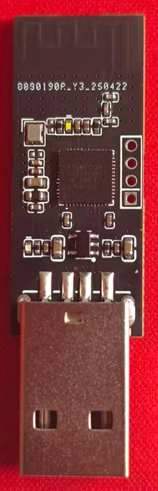
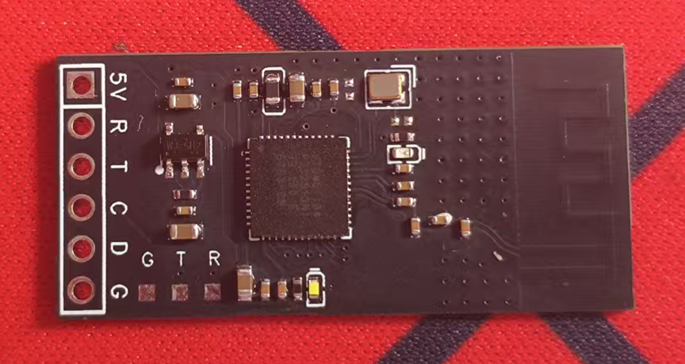

## 模组介绍

该模组是基于星闪无线通信技术的传输模组，模组分为发送和接收，发送模块可以无线传输音频数据和收发UART串口数据，接收模块可在PC上模拟出音频输入设备和USB-HID键盘设备。

### 接收模块

#### 核心功能

- 通过星闪接收发送端传输的音频数据和键盘指令
- 将音频数据通过 USB 音频接口实时传输给 PC
- 将键盘指令通过 USB-HID 接口发送给 PC，实现无线键盘功能

### 发送模块

- 实时采集PDM数字麦克风数据，并发送给接收模块
- 通过UART接口和外部通信，
- 解析JSON格式的claude code状态反馈
- 解析

