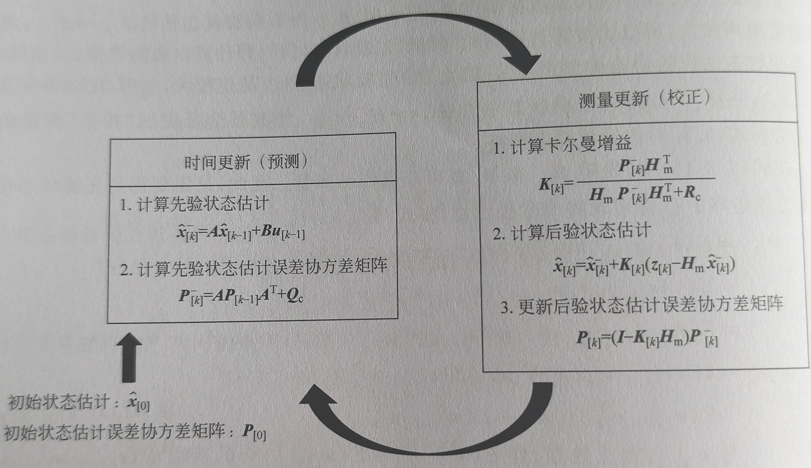

## 如何获取一个准确的值

在我们生活和工作中存在大量不确定性，主要包含以下三个方面。

 ```
 1、没有完美的模型（包括物理、噪声等）
 2、周边环境带来的不确定性
 3、测量传感器本身误差
 ```

滤波器正是为了解决这些问题而出现的，滑动平均等简单滤波方法难以兼顾响应速度与降噪效果，而卡尔曼滤波基于最小均方误差准则实现模型预测与观测数据的最优融合，同时凭借递推式计算结构保持极低的运算开销，无需存储大量历史数据即可实时运行，既能完成单路信号平滑去噪，也支持多传感器状态融合，是工程中兼顾精度与效率的优选方案。

## 什么是卡尔曼滤波器

从多个不确定的数据中，经过分析、推理和计算，得到一个相对准确的结果。数据可以是传感器的测量值，也可以是模型的估计值。

### 三大特性

```
1. 递归性：不需要存储历史数据，每一步只依赖上一拍的结果和当前的测量值，内存开销恒定。
2. 最优性：在线性系统和高斯噪声的前提下，它给出的结果是均方误差最小的，数学上是所有线性估计方法里最好的。
3. 滤波器 + 观测器：既能对含噪信号去噪，也能从可测量的量中推算出无法直接测量的内部状态。
```

### 预测-更新循环（核心结构预览）

卡尔曼滤波的工作方式是一个不断重复的两阶段循环：



- **预测阶段（先验估计）**：利用系统的物理模型，根据上一时刻的状态，推算出"如果没有任何测量，现在系统应该是什么状态"。同时也会推算"我对这个猜测有多不确定"。
- **更新阶段（后验估计）**：拿到传感器的实际测量值后，在预测值和测量值之间做一个最优的加权平均，得到当前拍的最终估计。谁的噪声小（可信度高），谁在加权中的比重就更大。

### 卡尔曼滤波的实际应用

卡尔曼滤波无处不在，几乎所有需要"从含噪数据中估计真实状态"的工程场景都有它的身影：

| 应用领域 | 具体场景 | 卡尔曼滤波在做什么 |
|:------:|:------|:------|
| 惯性导航/姿态估计 | 无人机、平衡车、机器人姿态解算 | 融合陀螺仪和加速度计，消除积分漂移 |
| GNSS/组合导航 | 车载导航、手机定位 | 融合GPS与IMU，在隧道等GPS失锁时继续推算 |
| 目标跟踪 | 自动驾驶感知、雷达跟踪 | 从含噪的雷达/视觉检测中平滑估计目标位置和速度 |
| 电池管理 | BMS电池SOC估计 | 融合电流积分（库仑计）与电压查表，精确估计剩余电量 |
| 过程控制 | 化工、温控系统 | 从含噪传感器中估计反应釜内部不可直接测量的温度和压力 |

## 卡尔曼滤波公式

### 全景图：预测-更新两阶段

| 阶段 | 编号 | 公式 | 作用 |
|:---:|:---:|:------|:------|
| 预测 | (1) | $\hat{x}_{k}^{-} = F\hat{x}_{k-1} + Bu_k$ | 用模型推算当前状态 |
| 预测 | (2) | $P_k^- = FP_{k-1}F^T + Q$ | 推算当前不确定度 |
| 更新 | (3) | $K_k = P_k^-H^T(HP_k^-H^T + R)^{-1}$ | 计算最优权重（卡尔曼增益） |
| 更新 | (4) | $\hat{x}_k = \hat{x}_{k}^{-} + K_k(z_k - H\hat{x}_{k}^{-})$ | 用测量值修正预测 |
| 更新 | (5) | $P_k = (I - K_kH)P_k^-$ | 更新融合后的不确定度 |

> 符号约定：带 $-$ 上标的是**先验**（预测值，还没用测量修正），不带的是**后验**（最终输出）。$F$ 是状态转移矩阵，$H$ 是测量矩阵，$Q$ 是过程噪声协方差，$R$ 是测量噪声协方差。

### 逐条公式讲解

#### 预测公式 (1)：$\hat{x}_{k}^{-} = F\hat{x}_{k-1} + Bu_k$

**它在做什么：推算"现在应该是多少"。**

用上一拍的最优估计 $\hat{x}_{k-1}$，乘以系统的运动规律 $F$，得到当前拍的预测值。如果有已知的外部输入 $u_k$（比如电机控制量），也通过 $B$ 矩阵加入。

打个比方：你上一秒在 $x=10$ 的位置，以 $v=2\ m/s$ 的速度前进。如果没有任何传感器告诉你别的信息，你只能靠 $x_{now} = 10 + 2 \times 1 = 12$ 来猜现在的位置。这里的 $F$ 矩阵就是在表达 $x+v\cdot dt$ 这个物理关系。

#### 预测公式 (2)：$P_k^- = FP_{k-1}F^T + Q$

**它在做什么：推算"现在有多不确定"。**

$P$ 是协方差矩阵，它描述了状态估计的**不确定度**。$P$ 的对角线元素是各状态自身的方差，非对角线元素是状态之间的关联不确定性。

这个公式做了两件事：
1. $FP_{k-1}F^T$：把上一拍的不确定度也用 $F$ 矩阵传播到当前时刻（不确定度也遵循系统的运动规律）
2. $+Q$：额外加上过程噪声——你对模型越不自信，$Q$ 就设得越大

#### 更新公式 (3)：$K_k = P_k^-H^T(HP_k^-H^T + R)^{-1}$

**它在做什么：计算卡尔曼增益——"这次该信模型多一点，还是信传感器多一点"。**

这是整个卡尔曼滤波器的**心脏**。$K$（卡尔曼增益）是一个比例因子，它在算：

$$K \approx \frac{\text{预测的不确定度}}{\text{预测的不确定度} + \text{测量噪声}}$$

- 如果测量噪声 $R$ 很大（传感器不可信） → $K$ 很小 → 几乎忽略测量值，只相信模型预测
- 如果预测不确定度 $P_k^-$ 很大（模型不可信） → $K$ 接近 1 → 几乎完全采用测量值
- 如果两者相当 → $K \approx 0.5$ → 各取一半

$K$ 是**动态变化**的——随着滤波器不断运行，$P$ 会慢慢减小（你越来越确定），$K$ 也会随之变小。

#### 更新公式 (4)：$\hat{x}_k = \hat{x}_{k}^{-} + K_k(z_k - H\hat{x}_{k}^{-})$

**它在做什么：用测量值修正预测，输出最优估计。**

括号里的 $z_k - H\hat{x}_{k}^{-}$ 叫做**新息（Innovation）**或**测量残差**——测量值和你预测的值之间差了多少。

这个公式本质上就是在做加权平均，看测量值和预测值所占得比例。

#### 更新公式 (5)：$P_k = (I - K_kH)P_k^-$

**它在做什么：更新融合后的不确定度。**

融合之后，你的不确定度一定会**下降**（因为融合了两个信息源）。降多少取决于 $K$：如果 $K$ 很大（你非常相信测量），不确定度就大幅下降；如果 $K$ 接近于零（你几乎不相信测量），不确定度几乎没有变化。

### 五个公式输入输出汇总

| 公式 | 输入 | 输出 | 通俗理解 |
|:---:|:------|:------|:------|
| (1) | 上一拍状态 $\hat{x}_{k-1}$、控制输入 $u_k$ | 预测状态 $\hat{x}_{k}^{-}$ | "推算现在应该是多少" |
| (2) | 上一拍不确定度 $P_{k-1}$、过程噪声 $Q$ | 预测不确定度 $P_k^-$ | "推算现在有多不确定" |
| (3) | 预测不确定度 $P_k^-$、测量噪声 $R$ | 卡尔曼增益 $K_k$ | "算出这次该信谁" |
| (4) | 预测状态 $\hat{x}_{k}^{-}$、测量值 $z_k$、增益 $K_k$ | 最优估计 $\hat{x}_k$ | "按最优比例修正" |
| (5) | 预测不确定度 $P_k^-$、增益 $K_k$ | 更新后不确定度 $P_k$ | "修正后还剩多少不确定" |

## 工程实例：用卡尔曼滤波融合加速度计和陀螺仪估计角度

这是我们最熟悉的场景：手上有一块 MPU6050，我们希望实时获取载体的俯仰角。

### 问题定义

- **陀螺仪**：测量角速度 $\omega$（°/s），积分可得角度。短期精度高，但零偏会随时间累积导致角度无限漂移。
- **加速度计**：通过重力分量反正切可得角度 $\theta_{acc} = \arctan(a_y, a_z)$。长期无漂移，但受振动影响大，瞬时噪声严重。

我们的目标：用卡尔曼滤波融合二者，取陀螺仪的**短期高精度** + 加速度计的**长期无漂移**，得到最优角度估计。

### 建立系统模型

#### 状态向量：我们要估计什么

$$x = \begin{bmatrix} \theta \cr b \end{bmatrix}$$

- $\theta$：载体的真实俯仰角（我们想要的）
- $b$：陀螺仪的零偏（我们顺便估计出来的，用来补偿陀螺仪原始数据）

为什么要估计零偏？因为陀螺仪零偏不是恒定的——它会随温度、时间缓慢变化。如果能在现实中估计出零偏，就可以从前端消除漂移的来源，比被动地用加速度计"拉回来"更优雅。

#### 状态转移方程（预测模型）

物理规律很直接：

- 角度的变化 = 角速度 × 时间（注意减去零偏）
- 零偏变化极慢，近似为常量（只加一点点噪声表示它允许缓慢漂移）

$$\theta_k = \theta_{k-1} + (\omega_k - b_{k-1}) \cdot \Delta t$$

$$b_k = b_{k-1}$$

写成矩阵形式：

$$\begin{bmatrix} \theta_k \cr b_k \end{bmatrix} = \begin{bmatrix} 1 & -\Delta t \cr 0 & 1 \end{bmatrix} \begin{bmatrix} \theta_{k-1} \cr b_{k-1} \end{bmatrix} + \begin{bmatrix} \Delta t \cr 0 \end{bmatrix} \omega_k$$

所以状态转移矩阵 $F$ 和控制矩阵 $B$ 为：

$$F = \begin{bmatrix} 1 & -\Delta t \cr 0 & 1 \end{bmatrix}, \quad B = \begin{bmatrix} \Delta t \cr 0 \end{bmatrix}$$

> 注意：这里的 $\omega_k$ 是**陀螺仪直接输出的角速度**。它在数学上是"控制输入"的角色——告诉系统这一时刻旋转了多少。

#### 测量方程（观测模型）

加速度计可以测量重力方向，从而反算出角度：

$$\theta_{acc} = \theta_k + v_k$$

其中 $v_k$ 是测量噪声（振动、加速度计自身噪声等）。写成矩阵形式：

$$z_k = \begin{bmatrix} 1 & 0 \end{bmatrix} \begin{bmatrix} \theta_k \cr b_k \end{bmatrix} + v_k$$

所以测量矩阵 $H$ 为：

$$H = \begin{bmatrix} 1 & 0 \end{bmatrix}$$

这个 $H$ 的含义是：**我们只能直接测量角度 $\theta$，不能直接测量零偏 $b$**。$b$ 的估计完全靠滤波器自己"推理"出来。

### 代入公式走一轮

模型建好了，$F$、$H$ 都是具体的矩阵，现在把它们代入五个公式，完整走一遍。假设以下参数：

| 参数 | 值 | 说明 |
|:---|:---|:---|
| $\Delta t$ | $0.01$ | 采样周期 10ms（100Hz） |
| 初始角度 $\theta_0$ | $0$ | 假设从水平面开始 |
| 初始零偏 $b_0$ | $0$ | 一开始不知道零偏是多少 |
| 初始协方差 $P_0$ | $\begin{bmatrix} 1 & 0 \cr 0 & 1 \end{bmatrix}$ | 对初始猜测不太自信，设大一点 |
| 过程噪声 $Q$ | $\begin{bmatrix} 0.001 & 0 \cr 0 & 0.000003 \end{bmatrix}$ | 角度模型有小误差；零偏变化极慢 |
| 测量噪声 $R$ | $0.03$ | 加速度计静止时角度方差的实测值 |
| 陀螺仪读数 $\omega_k$ | $0.5\ °/s$ | 假设载体以 0.5°/s 匀速转动 |

假设某一时刻传感器读到：
- 陀螺仪角速度 $\omega_k = 0.5\ °/s$
- 加速度计反算角度 $z_k = 5.2°$

#### 第一步：预测

**公式 (1)：状态预测** $\hat{x}_{k}^{-} = F\hat{x}_{k-1} + B u_k$

```math
\hat{x}_{k}^{-} = 
\begin{bmatrix} 1 & -0.01 \\ 0 & 1 \end{bmatrix}
\begin{bmatrix} 0 \\ 0 \end{bmatrix}
+
\begin{bmatrix} 0.01 \\ 0 \end{bmatrix}
\cdot 0.5
=
\begin{bmatrix} 0 \\ 0 \end{bmatrix}
+
\begin{bmatrix} 0.005 \\ 0 \end{bmatrix}
=
\begin{bmatrix} 0.005 \\ 0 \end{bmatrix}
```

预测结果是：角度约 $0.005°$，零偏仍为 $0$。

**公式 (2)：协方差预测** $P_k^- = FP_{k-1}F^T + Q$

先算 $FPF^T$（不确定度也按系统规律传递到当前时刻）：

$$
FPF^T =
\begin{bmatrix} 1 & -0.01 \cr 0 & 1 \end{bmatrix}
\begin{bmatrix} 1 & 0 \cr 0 & 1 \end{bmatrix}
\begin{bmatrix} 1 & 0 \cr -0.01 & 1 \end{bmatrix}
=
\begin{bmatrix} 1.0001 & -0.01 \cr -0.01 & 1 \end{bmatrix}
$$

再加上 $Q$：

$$
P_k^- =
\begin{bmatrix} 1.0001 & -0.01 \cr -0.01 & 1 \end{bmatrix}
+
\begin{bmatrix} 0.001 & 0 \cr 0 & 0.000003 \end{bmatrix}
=
\begin{bmatrix} 1.0011 & -0.01 \cr -0.01 & 1.000003 \end{bmatrix}
$$

对角线元素 $P_{00}=1.0011$ 表示目前对角度估计还很不确定（方差约 1），$P_{11}=1.000003$ 表示零偏估计同样不确定。

#### 第二步：更新

**公式 (3)：卡尔曼增益** $K_k = P_k^-H^T(HP_k^-H^T + R)^{-1}$

先算 $HP_k^-H^T$（预测的不确定度投影到测量空间）：

$$
HP_k^-H^T =
\begin{bmatrix} 1 & 0 \end{bmatrix}
\begin{bmatrix} 1.0011 & -0.01 \cr -0.01 & 1.000003 \end{bmatrix}
\begin{bmatrix} 1 \cr 0 \end{bmatrix}
=
1.0011
$$

这个值就是"我对角度预测有多不确定"。加上测量噪声后：

$$
S = HP_k^-H^T + R = 1.0011 + 0.03 = 1.0311
$$

再算 $P_k^-H^T$：

$$
P_k^-H^T =
\begin{bmatrix} 1.0011 & -0.01 \cr -0.01 & 1.000003 \end{bmatrix}
\begin{bmatrix} 1 \cr 0 \end{bmatrix}
=
\begin{bmatrix} 1.0011 \cr -0.01 \end{bmatrix}
$$

最后得到卡尔曼增益：

$$
K_k = \frac{1}{1.0311}
\begin{bmatrix} 1.0011 \cr -0.01 \end{bmatrix}
=
\begin{bmatrix} 0.971 \cr -0.0097 \end{bmatrix}
$$

> 关键解读：**$K$ 是两个数，不是一个数。**
> - $K_0 = 0.971$ → 测量值和预测值的差异中，**97%** 拿来修正角度。因为目前很不确定（$P_{00}=1.0011$ 远大于 $R=0.03$），滤波器选择"大幅相信测量"。
> - $K_1 = -0.0097$ → 差异中约 **1%** 拿来修正零偏，且是**反向修正**（负号）。因为 $P_{10}=-0.01$ 表示角度和零偏的估计是负相关的——如果角度预测偏高了，那零偏可能也被估高了。

**公式 (4)：状态更新** $\hat{x}_k = \hat{x}_{k}^{-} + K_k(z_k - H\hat{x}_{k}^{-})$

新息（测量值和预测值的差）：

$$
z_k - H\hat{x}_{k}^{-} = 5.2 - 0.005 = 5.195
$$

测量值比预测值大了 $5.195°$，这差的有点多，说明初始零偏猜测（0）很可能不对。

用增益修正：

$$
\hat{x}_k =
\begin{bmatrix} 0.005 \cr 0 \end{bmatrix}
+
\begin{bmatrix} 0.971 \cr -0.0097 \end{bmatrix}
\cdot 5.195
=
\begin{bmatrix} 0.005 + 5.044 \cr 0 - 0.050 \end{bmatrix}
=
\begin{bmatrix} 5.049° \cr -0.050\ °/s \end{bmatrix}
$$

更新后的角度估计从 $0.005°$ 跳到了 $5.049°$，大幅向测量值靠拢了。同时零偏从 $0$ 被修正为 $-0.050\ °/s$，这就是滤波器在"推理"零偏——虽然测不到，但通过角度预测偏差间接推断出来了。

**公式 (5)：协方差更新** $P_k = (I - K_kH)P_k^-$

$$
I - K_kH =
\begin{bmatrix} 1 & 0 \cr 0 & 1 \end{bmatrix}
-
\begin{bmatrix} 0.971 \cr -0.0097 \end{bmatrix}
\begin{bmatrix} 1 & 0 \end{bmatrix}
=
\begin{bmatrix} 0.029 & 0 \cr 0.0097 & 1 \end{bmatrix}
$$

$$
P_k =
\begin{bmatrix} 0.029 & 0 \cr 0.0097 & 1 \end{bmatrix}
\begin{bmatrix} 1.0011 & -0.01 \cr -0.01 & 1.000003 \end{bmatrix}
=
\begin{bmatrix} 0.029 & -0.00029 \cr 0 & 0.9999 \end{bmatrix}
$$

更新后 $P_{00}$ 从 $1.0011$ 骤降到 $0.029$——因为这次大幅相信了测量（$K_0=0.971$），角度不确定度被压低了近 35 倍。$P_{11}$ 也从 $1.000003$ 降到 $0.9999$，因为 $K_1$ 很小，零偏的确定度提升有限。

#### 第二轮会发生什么

经过第一轮，滤波器得到了更可靠的状态和更小的 $P$。第二轮再跑的时候：

- $P_{00}$ 变小了 → 预测阶段加回 $Q$ 后也不会涨太多 → $K_0$ 会变小（不会再 97% 相信测量了）
- 零偏已经有了估计值（$-0.050\ °/s$）→ 预测角度时自动扣掉，漂移从源头就被抑制
- 几轮之后 $K$ 会稳定到一个"合理"的水平，滤波器进入平稳工作状态

这就是卡尔曼滤波在角度估计中的完整推理过程——五个公式环环相扣，不是魔法，就是一步步的矩阵运算。

> 完整可落地的伪代码实现（矩阵全部展开为标量运算），见 [[Kalman Filter 伪代码]]。

## 与其他滤波/融合算法的关系

在已经了解的几种姿态估计算法中，卡尔曼滤波处于什么位置？下表给出直观对比：

|  | 一阶互补滤波 | Mahony 滤波器 | 卡尔曼滤波 |
|:---|:---:|:---:|:---:|
| **核心思想** | 高通 + 低通互补 | PI 控制器修正 + 四元数更新 | 模型预测与测量的最优加权 |
| **可调参数** | 1 个（滤波系数 $\alpha$） | 2 个（PI 的 $K_p, K_i$） | 2 个矩阵（$Q, R$），各自可能含多个元素 |
| **零偏估计** | ✗ 不估计 | ✓ PI 积分项在线估计 | ✓ 作为状态变量在线估计（更系统化） |
| **万向锁** | 取决于角度表示方法 | ✓ 使用四元数，无万向锁 | 取决于状态表示（本文示例是 1D 角度所以不涉及） |
| **理论最优性** | ✗ 经验方法 | ✗ 经验方法 | ✓ 在线性+高斯假设下理论最优 |
| **计算量** | 极小 | 小 | 小~中等（取决于状态维度） |
| **调参难度** | 极低 | 低~中 | 中（需要理解 Q/R 的物理含义） |
| **适用场景** | 简单平衡、粗略姿态 | 多数姿态估计，含零偏估计 | 噪声特性已知、追求最优精度 |

### 卡尔曼滤波的定位

> 关于一阶互补滤波和 Mahony 滤波器的详细原理与实现，可参考 [[Gyroscope]]。

简单来说：
- 刚入门、做平衡车、简单姿态显示 → **一阶互补滤波**，一个参数调好就够用
- 需要解决陀螺仪零偏漂移、有一定精度要求 → **Mahony 滤波器**，PI 控制器直观好调
- 你知道传感器噪声特性、想要理论最优的精度、或者需要同时估计多个相互关联的状态 → **卡尔曼滤波**

三者不是替代关系，而是递进关系。在实际项目中，选择哪一种取决于你对精度、复杂度和调试时间之间的权衡。

### 相关笔记

- [[Gyroscope]] — 陀螺仪误差分析、一阶互补滤波与 Mahony 滤波器的详细介绍
- [[MPU6050]] — MPU6050 芯片寄存器详解、欧拉角与四元数基础
