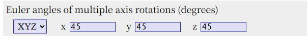
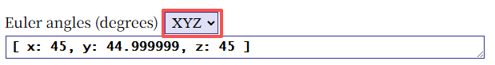
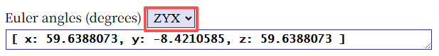
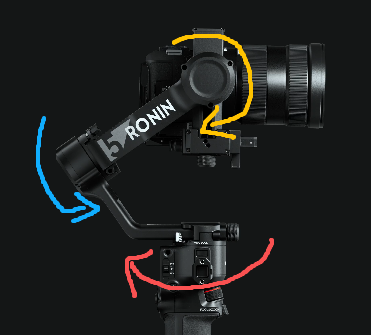
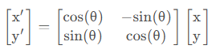
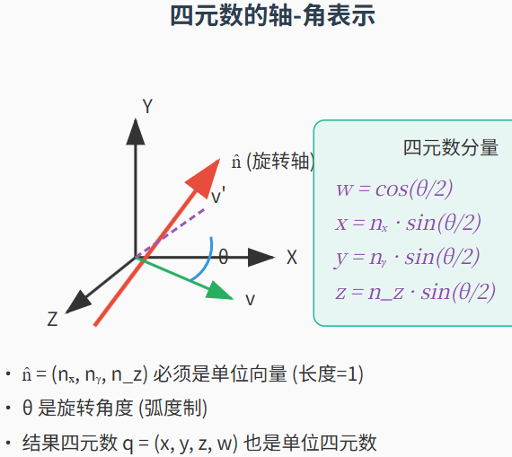
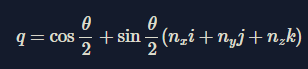
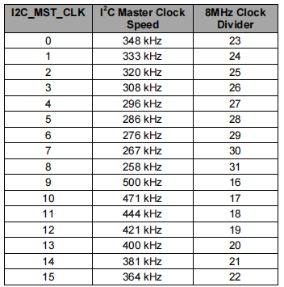
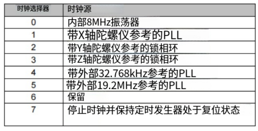
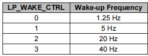

## 芯片核心功能

## 欧拉角

### 基本定理

在复杂的空间中的转动都能拆解成三个独立、简单的单轴转动，这三个转动对应的角度就是欧拉角。

### 坐标系概念

**本体坐标系**：固定在陀螺仪 / 载体上的坐标系，三个轴跟着陀螺仪一起动，陀螺仪直接测量物体的角速度，就是绕这个本体坐标系三轴的转动速度。

**世界坐标系**：固定在地面上的**绝对坐标系**，比如我们常说的东、南、西、北、上、下，不管载体怎么转动，这个坐标系永远固定不动。

欧拉角所使用的就是本体坐标系。

### 旋转的麻烦

#### 旋转顺序

 在欧拉角中，旋转顺序直接决定了物体最终的形态，就算给定相同的旋转角度参数，旋转顺序不同，最终计算的结果也不相同。

下图是以X-Y-Z顺序分别旋转45度后，计算得到的欧拉角的值。

而如果我们是以Z-Y-X的顺序旋转我们得到的结果就是这样的。

出现这样变化的原因是，每一次旋转，都会改变其他两个旋转轴的方向。

三维旋转从数学公式的角度来看，其实是三个旋转矩阵的乘积，因为矩阵乘法不满足交换律，所以矩阵的先后顺序就对应的是旋转顺序。

#### 万向节死锁现象

##### 什么是万向节死锁

假设当载体使用Z-Y-X旋转顺序，且俯仰角（旋转顺序的中间轴）转动至 ±90° 时，原本相互独立的偏航、横滚两个转轴会在空间上完全共线，两个独立自由度完全耦合，导致无法独立控制所有旋转方向，这种情况称为万向节死锁

万向锁不是陀螺仪硬件故障，也不是测量误差，而是**欧拉角这种姿态表达方法，天生自带的、无法消除的数学奇点**。也可以理解为旋转到某一位置下的非固定解。

##### 万向锁产生的原因

用 3 个线性参数（欧拉角），去描述三维刚体姿态的结构，必然会出现至少一个不可消除的奇异点，万向锁就是这个奇异点的具象化表现。

##### 嵌套关系（机械设计上的问题）

从机械设计的角度不可避免得就会引入欧拉角得旋转顺序关系，在一个云台控制系统中，天然地就会引入嵌套关系。

以上图云台为例，红色轴的旋转就是外轴，蓝色轴的旋转就是中间轴，黄色轴的旋转就是内轴，当我们转动蓝色中间轴，使外轴和内轴的轴心重合，就会使云台混乱，我们调节外轴和内轴的角度都只会调节相机俯仰视角的变换，但这时候就两个轴的电机执行器都可以完成这样的现象，这样就会出错，执行器不知道要哪个电机来动，就会造成混乱。

#### 欧拉角插值问题

## 四元数

四元数旋转的核心思想是使用单位复数乘法，在四维复数下表示三维空间向量旋转。

### 2D平面如何表示旋转

复数  $z = a + bi$  转换为极坐标形式   $z = r（cosα +i sinα） = re^{iα}$ ,当r = 1时，乘以复数$e^{iα}$就是绕原点旋转α角

如果  $z = re^{iα}$   那么  $z' = e^{iβ} \cdot z$   

写成矩阵的形式如下图所示

和帕克变换不能说一摸一样只能说时很像。中间的变换矩阵就是帕克变换的转置。

### 3D平面旋转

#### 旋转矩阵

我们可以用一个  $3*3$  的旋转矩阵来讲描述一个物体在三维空间中的转动，它在数学上很可靠，也解决了万向节死锁的问题，但是这种方法就很臃肿，只有三个角度参数的变化，我们却使用了9个数字来描述这三个参数的变化，在实际计算中，矩阵会因为累计误差逐渐偏离，所以我们需要不断计算来修正它。

那么有什么好方法，用更少的参数和计算量来描述这个运动呢，这时候就要抛弃向量和矩阵，从复数的角度来解这个问题。

#### 旋转的复数表示

那么我们应该怎么用复数来表示3D的旋转。

有位数学家（**哈密顿**）研究发现，需要三个虚数单位**i、j、k**才能推广到3D平面。

四元数可以分解为标量部分和向量部分

$q = w + xi +yj+ zk$

其中  $w$  是标量部分，$xi +yj+ zk$  是矢量部分。

其中虚数单位满足哈密顿关系：

$i^2 = j^2 = k^2 = ijk = -1$

它们满足负交换律，即：

$ij = k,jk = i,ki=j$

而

$ji = -k,kj = -i,ik = -j$

所以在有了关于四元数的这些基础知识后，它是如何让一个物体旋转的呢

假设在一个三维空间中，我们都可以用一个三维向量来表示物体的朝向，我们将这个三维向量转换成一个**纯四元数P**（标量为0），要使用一个**单位旋转四元数q**（模长为1）来旋转这个向量，我们就要构造一个“三明治”积，即：  $P' = qPq^-1$   ，计算的结果  $P'$  就是另一个四元数，其矢量部分就是我们得到的旋转后的矢量  $\vec v'$  对于单位四元数，它的**逆**就是它的**共轭**，证明可见附录。

### 轴-角法

四元数表示旋转的核心思想是**轴-角** 表示法

三维空间中的任何旋转都可以用个一个旋转轴（单位向量）和一个旋转角来描述。

对应的单位四元数公式：

其中  $w$  表示旋转角度，  $（x，y，z）$  表示绕旋转轴。

那从公式上看，轴角似乎就可以直观得表示向量的旋转，那么我们直接使用轴角来算不也可以吗？

其实从易懂的角度来看，确实是这样，但如果我们从数学角度来看

如果使用轴角法进行旋转合成，就要先将旋转值转换成3x3的旋转矩阵，然后再将每个轴角旋转对应的旋转矩阵合成变为总的旋转矩阵，然后再逆解算出轴角值。 

虽然轴角法能够很直观得表示旋转角度和旋转轴，但在数学运算上相比较于四元数会更复杂。

四元数左乘和右乘

### 四元数的更新

到了这里我们对四元数有了个模糊的了解，因为到了四维的这一维度了，跟我们现实世界的关联就降低了很多，但在陀螺仪上的计算我们其实我们有了前面的这些知识已经基本够用了。

我们知道陀螺仪能测量到的只有三轴的角速度和三轴的加速度。那我们在代码初始化的时候会先定义一个初始的四元数，这个四元数标量为1，矢量为0。

**旋转角度**  $α = |w| · dt$  ，其中  $|w|$  是角速度的模，  $dt$  是采样时间

**旋转轴**  $n = w/|w|$  ，最后旋转轴  $n = （n_x，n_y，n_z）$  。

那么有了**旋转轴**和**旋转角度**，用轴角法就可以将变化的数据转换成**旋转四元数**了。

这样我们有了**初始四元数**也有了**旋转四元数**，将两个四元数相乘就可以得到更新后的四元数了。

在这里，两个四元数相乘也是需要遵守四元数乘法规则，这里分为了左乘和右乘，这里面的乘针对的是**旋转四元数**的。

左乘：表示在**世界坐标系**下旋转

右乘：表示在**本体坐标系**下旋转

在一般的应用中，新姿态 = 变化姿态 * 旧姿态，也就是用了左乘。

在计算得到新姿态的四元数后要统一进行

 

mpu6050在上电后会进入休眠模式

## 寄存器功能

### 0X01

通信电平选择

0：以**VLOGIC**引脚为参考电压

1：以**VDD**引脚为参考电压

### 0X0D

### 0X19      R/W

**SMPLRT_DIV**      配置数据输出速率

它的速率与0x1A中**DLPF_CFG**（数字低通滤波器配置位）有关，

| DLPF_CFG | 输出速率 |     使用场景      |
| :------: | :--: | :-----------: |
|   0/7    | 8KHZ | 关闭滤波，需要高采样率场景 |
|   1~6    | 1KHZ |   开启滤波，一般使用   |

加速度计的采样率固定为1KHZ

- 如果采样率>1KHZ，同一个数据会被多次发送到fifo，dmp，和传感器寄存器中。

采样率计算公式：

- 采样率 = 陀螺仪输出频率/（1/SMPRT_DIV）

陀螺仪输出频率由**0x1A**寄存器中**DLPF_CFG**决定

### 0X1A      R/W

**EXT_SYNC_SET**    外部帧同步配置（暂时每搞懂逻辑）

将 **FSYNC** 引脚的电平状态，在 IMU 采样的瞬间锁存，并映射到陀螺仪 / 加速度计的数据寄存器最低位，实现 IMU 采样数据与外部事件的硬件级时间同步。

| EXT_SYNC_SET | FSYNC位锁存数据映射位置  |
| :----------: | :-------------: |
|      0       |      禁止输入       |
|      1       |  TEMP_OUT_L[0]  |
|      2       | GYRO_XOUT_L[0]  |
|      3       | GYRO_YOUT_L[0]  |
|      4       | GYRO_ZOUT_L[0]  |
|      5       | ACCEL_XOUT_L[0] |
|      6       | ACCEL_YOUT_L[0] |
|      7       | ACCEL_ZOUT_L[0] |

**DLPF_CFG**    数字低通滤波器配置

采样率的计算要参考该配置带入计算

加速度计和陀螺仪滤波参数配置

| DLPF_CFG |  加速度计  |  加速度计  | 陀螺仪    | 陀螺仪    | 陀螺仪     |
| :------: | :----: | :----: | ------ | ------ | ------- |
|          | 带宽（hz） | 延时（ms） | 带宽（hz） | 延时（ms） | 频率（khz） |
|    0     |  260   |   0    | 256    | 0.98   | 8       |
|    1     |  184   |  2.0   | 288    | 1.9    | 1       |
|    2     |   94   |  3.0   | 98     | 2.8    | 1       |
|    3     |   44   |  4.9   | 42     | 4.8    | 1       |
|    4     |   21   |  8.5   | 20     | 8.3    | 1       |
|    5     |   10   |  13.8  | 10     | 13.4   | 1       |
|    6     |   5    |  19.0  | 5      | 18.6   | 1       |
|    7     |        |        |        |        | 8       |

### 0X1B      R/W

**XG_ST/YG_ST/ZG_ST**  陀螺仪硬件自检触发位

当这一位写入1时，芯片内部会向该轴的陀螺仪微机械结构施加一个固定的静电驱动力，迫使检测质量块产生一个已知的、固定的偏转，模拟真实的角速度输入。此时读取该轴的陀螺仪原始数据，若输出值在官方规格书规定的范围内，则说明该轴陀螺仪硬件正常；若输出值异常（无变化、超出范围），则说明硬件存在故障。

**FS_SEL**    陀螺仪量程范围选择位

| FS_SEL |   量程范围    |
| :----: | :-------: |
|   0    | +-250°/s  |
|   1    | +-500°/s  |
|   2    | +-1000°/s |
|   3    | +-2000°/s |

满量程范围越小，灵敏度越高，精度越高；反之，满量程范围越大，灵敏度越低，测量精度越差。

### 0X1C      R/W

**XA_ST/YA_ST/ZA_ST**    加速度计硬件自检触发位

同陀螺仪硬件自检触发原理。

**AFS_SEL**   加速度计量程选择位

| AFS_SEL | 量程范围  |
| :-----: | :---: |
|    0    | +-2g  |
|    1    | +-4g  |
|    2    | +-8g  |
|    3    | +-16g |

量程、灵敏度、精度关系同陀螺仪选择位。

### 0X23      R/W

**TEMP_FIFO_EN**    温度数据FIFO自动写入使能

**XG_FIFO_EN/YG_FIFO_EN/ZG_FIFO_EN**   加速度计数据自动写入使能

**SLV2_FIFO_EN/SLV1_FIFO_EN/SLV0_FIFO_EN**  辅助i2c总线从机2/1/0数据自动写入使能

### 0x24      R/W

**MULT_MST_EN**    多主机模式使能

只有辅助i2c总线上给你有其他主机设备时才要开启

**WAIT_FOR_ES**     外部传感器数据同步等待使能

开启后只有辅助i2c上所有外部从机数据全部读取完成并写入寄存器后才会触发中断

**SLV3_FIFO_EN**      辅助i2c从机3数据自动写入使能

**I2C_MST_P_NSR**     辅助i2c两个从机读操作的过度模式

0：两次读操作之间发送Restart，通信速率更块快。

1：两次读操作之间发送Stop+Start信号，兼容性更强。

**I2C_MST_CLK**     辅助i2c时钟频率配置

参考下图：

### 0X25      R/W

**I2C_SLV0_RW**     从机0读写操作位

**I2C_SLV0_ADDR**     从机0地址数据

### 0X26      R/W

**I2C_SLV0_REG**     从机0内部操作的起始寄存器地址

### 0X27       R/W

**I2C_SLV0_EN**      从机0通道使能操作

**I2C_SLV0_BYTE_SW**      字节交换使能位

适配外部传感器 16 位数据的高低字节输出顺序，无需 MCU 手动翻转

**I2C_SLV0_REG_DIS**      从机0寄存器地址传输禁用位

1：仅适配无寄存器地址的特殊外设

0：默认常规模式，先写从机寄存器地址，再执行读写操作

**I2C_SLV0_GRP**      字节分组规则位

**I2C_SLV0_LEN**      连续写入递增的寄存器地址

### 0X28  0X29  0X2A      R/W

同0X25/26/27寄存器功能，不过是从机1的配置。

### 0X2B  0X2C  0X2D      R/W

同0X25/26/27寄存器功能，不过是从机2的配置。

### 0X2E  0X2F  0X30      R/W

同0X25/26/27寄存器功能，不过是从机3的配置。

### 0X31  0X32      R/W

同0X25/26寄存器功能，是从机4的配置。

### 0X33      R/W

**I2C_SLV4_DO**      从机4的写模式专用数据缓存寄存器。

### 0X34      R/W

**I2C_SLV4_EN**      从机4通道总使能，在传输完成后，会被**自动清零**。

**I2C_SLV4_INT_EN**      传输完成中断使能位

**I2C_SLV4_REG_DIS**      寄存器地址传输禁止位

**I2C_MST_DLY**      配置从设备相对于采样率的访问速率降低

### 0X35      R/W

**I2C_SLV4_DI**      从机4读模式专用数据缓存寄存器

### 0X36      R

**PASS_THROUGH**      外部 FSYNC 引脚的中断信号有效时，该位自动置 1

**I2C_SLV4_DONE**      从机4通道的单次读写传输完成（无论成功 / 失败）时，该位自动置 1

**I2C_LOST_ARB**      辅助 I2C 主机在通信中丢失总线仲裁权时，该位自动置 1

**I2C_SLV4_NACK/I2C_SLV3_NACK/I2C_SLV2_NACK/I2C_SLV1_NACK/I2C_SLV0_NACK**

从机0~4通道通信时，收到从机的NACK信号时，该位自动置1

### 0X37      R/W

**INT_LEVEL**      INT中断引脚电平配置

0：有效电平为高电平

1：有效电平为低电平

**INT_OPEN**      INT中断引脚输出模式配置

0：推挽输出

1：开漏输出

**LATCH_INT_EN**      中断锁存模式配置

0：输出50us的脉冲

1：保持有效电平，知道中断标志位被清除

**INT_RD_CLEAR**      中断状态清除规则配置

0：中断状态位仅在读取 INT_STATUS 寄存器（0x3A）后自动清零

1：中断状态位在对 MPU6050 执行任何读操作后都会自动清零

**FSYNC_INT_LEVEL**      FSYNC引脚中断有效电平

0：有效电平为高电平

1：有效电平为低电平

**FSYNC_INT_EN**      FSYNC引脚中断使能开关

0：关闭 FSYNC 引脚的中断透传功能

1：开启 FSYNC 中断透传

**I2C_BYPASS_EN**      辅助 I2C 总线旁路模式总开关

0：关闭旁路模式

1：开启旁路模式，必须同时满足USER_CTRL寄存器的I2C_MST_EN=0

### 0X38      R/W

**FIFOOFLOW_EN**      FIFO缓冲区中断使能

0：关闭FIFO溢出中断

1：开启FIFO溢出中断，发生溢出会触发INT引脚中断

**I2C_MST_INT_EN**      辅助I2C主机中断总使能

0：关闭辅助I2C主机所有事件的中断

1：开启辅助I2C主机中断

**DATA_RDY_EN**      数据就绪中断使能

0：关闭数据就绪中断

1：开启数据就绪中断

### 0X3A      R

**FIFO_OFLOW_INT**      FIFO 缓冲区溢出中断状态位

事件触发时，该位自动置 1，读取后自动清零。

**I2C_MST_INT**      辅助 I2C 主机中断总状态位

事件触发时，该位自动置 1，读取后自动清零。

**DATARDY_INT**      数据就绪中断状态位

全部更新完成后，该位自动置 1，读取后自动清零。

### 0X3B/0X3C      R

最近一次加速度计X轴数据补码寄存器，0X3B为高八位，0X3C为低八位。

### 0X3D/0X3E      R

最近一次加速度计Y轴数据补码寄存器，0X3D为高八位，0X3E为低八位。

### 0X3F/0X40      R

最近一次加速度计Z轴数据补码寄存器，0X3F为高八位，0X40为低八位。

### 0X41/0X42      R

最近一次温度测量数据补码寄存器，0X41为高八位，0X42为低八位。

转换为实际物理温度（℃）计算公式

- 实际物理温度 = （寄存器温度值）/340+36.53

### 0X43/0X44      R

最近一次陀螺仪X轴数据补码寄存器，0X43为高八位，0X44为低八位。

### 0X45/0X46      R

最近一次陀螺仪Y轴数据补码寄存器，0X45为高八位，0X46为低八位。

### 0X47/0X48      R

最近一次陀螺仪Z轴数据补码寄存器，0X47为高八位，0X48为低八位。

### 0X49~0X60      R

**EXT_SENS_DATA_00~EXT_SENS_DATA_23**

辅助I2C总线读取，从机0~从机3的外部传感器数据

**分配顺序**：严格按照`SLV0→SLV1→SLV2→SLV3`的优先级，从`EXT_SENS_DATA_00`开始，按每个通道配置的读取字节数（`I2C_SLVx_LEN`）连续分配地址。

**容量上限**：总共 24 个寄存器，SLV0~3 所有通道的总读取字节数不能超过 24，超出的字节会直接丢失。

### 0X63      R/W

**I2C_SLV0_DO**      从机0写操作下写入的数据

### 0X64      R/W

**I2C_SLV1_DO**      从机1写操作下写入的数据

### 0X65      R/W

**I2C_SLV2_DO**      从机2写操作下写入的数据

### 0X66      R/W

**I2C_SLV3_DO**      从机3写操作下写入的数据

### 0X67            R/W

**DELAY_ES_SHAOW**      外部传感器数据更新延迟控制

0：正常更新，每完成一个从机的读取，就立即更新对应的数据寄存器

1：延迟更新，必须等 SLV0~4 所有从机的读取操作全部完成后，才一次性更新所有外部传感器数据寄存器

**I2C_SLV4_DLY_EN**      SLV4 降速访问使能

**I2C_SLV3_DLY_EN**      SLV3 降速访问使能

**I2C_SLV2_DLY_EN**      SLV2 降速访问使能

**I2C_SLV1_DLY_EN**      SLV1 降速访问使能

**I2C_SLV0_DLY_EN**      SLV0 降速访问使能

降速访问频率计算公式

- 1/（1+I2C_MST_DLY）

I2C_MST_DLY在0X34寄存器配置

### 0X68           W

**GYRO_RESET**      陀螺仪信号路径复位

**ACCEL_RESET**      加速度计信号路径复位

**TEMP_RESET**      温度传感器信号路径复位

### 0X6A            R/W

**FIFO_EN**       FIFO 缓冲区使能位

**I2C_MST_EN**      辅助 I2C 主机模式总开关

0：关闭 I2C 主机模式，辅助 I2C 总线直通主 I2C 总线，是开启旁路模式的必要配置。

1：开启 I2C 主机模式，MPU6050 作为主机控制辅助 I2C 总线，自动读写外接传感器。

**I2C_IF_DIS**      主通信接口切换开关（mpu6050只能配置为0）

**FIFO_RESET**       FIFO 缓冲区复位位

**I2C_MST_RESET**      辅助 I2C 主机复位位

**SIG_COND_RESET**      传感器信号条件复位位

复位所有传感器（陀螺仪、加速度计、温度）的信号路径，同时清空所有传感器数据寄存器，复位完成后自动清零。

### 0X6B            R/W

**DEVICE_RESET**       芯片硬件复位

**SLEEP**       睡眠模式总开关

0：唤醒芯片

1：进入睡眠模式

**CYCLE**       循环低功耗模式开关

0：芯片正常工作

1：芯片进入循环唤醒模式，在睡眠和单次加速度计采样之间循环。

**TEMP_DIS**       温度传感器开关

0：开启温度传感器，正常采样

1：关闭温度传感器，停止采样

**CLKSEL**       系统时钟源选择

### 0X6C            R/W

**LP_WAKE_CTRL**       加速度计低功耗模式的唤醒频率配置

**STBY_XA**       X轴加速度待机控制位

**STBY_YA**       Y轴加速度待机控制位

**STBY_ZA**       Z轴加速度待机控制位

**STBY_XG**       X轴陀螺仪待机控制位

**STBY_YG**       Y轴陀螺仪待机控制位

**STBY_ZG**       Z轴陀螺仪待机控制位

### 0X72/0X73            R

FIFO缓存区样本数量        0X72位高八位，0X73为低八位

### 0X74            R/W

从FIFO缓冲区传输数据

### 0X75            R/W

MPU6050  I2C通信地址

## 附录

### 四元数  $q^-1 = q^*$  证明

