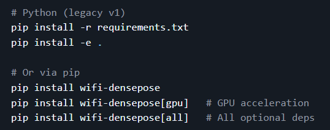

## 包管理器

我们在复刻github上的项目的时候会看到非常多的命令行操作，刚开始的时候我们都一脸懵逼，它们都在做什么呢。

我们先来找一个项目作为实例先来做一个粗浅的了解。

我们可以看到，这个里有5行命令，每一个命令的开头都是pip install这个形式，install我们都知道什么意思，安装嘛，那前面的pip呢，其实它是一个包管理器的名字，那这里我们基本也就大概能猜出个大概了，就是包管理器安装了一个东西，东西就是install后面的内容了。

比如下面的三个命令

- pip install wifi-densepose
- pip install wifi-densepose[gpu]
- pip install wifi-densepose[all]

这三个命令都是安装了wifi-densepose这个python包，这个包是做什么的感兴趣的可以深入去查询下，对于刚接触命令行的我们来说，只要能看懂就可以了，后面中括号内的是对这个包的扩展描述。

比如gpu后缀的就是在基础版上额外安装支持GPU加速的依赖。

## 系统级包管理工具

|  包管器名称   |                        可以支持的系统                         |                       跨平台使用                        |
| :------: | :----------------------------------------------------: | :------------------------------------------------: |
| APT dpkg |               Debian、Ubuntu等Debian衍生版系统                |                 仅支持Linux Dibian系统                  |
|  pacman  |                Linux Arch、Manjaro等衍生版系统                |                  仅支持Linux Arch系统                   |
| Portage  |            Linux Gentoo、Funtoo、ChromeOS底层系统            |                 仅支持Linux Gentoo系统                  |
|   pkg    |          FreeBSD、NetBSD、OpenBSD、DragonFlyBSD           |                     仅支持BSD系列系统                     |
|   DNF    |             RHEL/CentOS/Fedora 体系下**旧版**系统             |                 仅支持Linux RHEL旧版系统                  |
|   YUM    |             RHEL/CentOS/Fedora 体系下**新版**系统             |                 仅支持Linux RHEL新版系统                  |
|  Zypper  |           openSUSE、SUSE Linux Enterprise等系统            |                  仅支持Linux SUSE系统                   |
|   RPM    | RHEL系列、Fedora、CentOS、openSUSE、SUSE Linux Enterprise等系统 |               仅支持Linux REL和SUSE系统底层                |
|   Nix    |                         NixOS                          |          支持全Linux发行版、macOS、Windows WSL2系统          |
| Homebrew |               macOS、Linux、Windows（WSL2）                |          支持全Linux发行版、macOS、Windows WSL2系统          |
|   Snap   |                  Ubuntu、绝大多数Linux发行版                   | Ubuntu 默认安装，支持绝大多数 Linux 发行版，Windows、macOS 提供实验性支持 |
| Flatpak  |           Fedora、Ubuntu、Debian、Arch等Linux系统            |                   仅支持大多数Linux系统                    |
|  winget  |                Windows10、Windows11以上版本                 |                    仅支持Windows系统                    |
| MacPorts |                        macOS全系                         |                     仅支持macOS系统                     |
|   Fink   |                        macOS全系                         |                     仅支持macOS系统                     |

## 编程语言级包管理工具

专门用于特定编程语言生态的工具，负责该语言的第三方库、框架、工具链的依赖解析、版本管理、安装 / 卸载 / 更新，以及项目构建、发布等开发流程，仅作用于**开发 / 应用运行环境**，不触碰操作系统核心组件。

|  包管器名称   |         编程语言          |         可支持的系统平台         |
| :------: | :-------------------: | :----------------------: |
|   pip    |         Pyhon         | 全平台（Linux、Windows、macOS） |
|  Conda   |    Pyton、R 、Julia     | 全平台（Linux、Windows、macO）  |
|   npm    | JavaScript、TypeScript | 全平台（Linux、Windows、macO）  |
|   yarn   | JavaScript、TypeScript | 全平台（Linux、Windows、macO）  |
|   pnpm   | JavaScript、TypeScript | 全平台（Linux、Windows、macO）  |
|  maven   |      Java、Kotlin      | 全平台（Linux、Windows、macO）  |
|  Gradle  |      Java、Kotlin      | 全平台（Linux、Windows、macO）  |
|  go mod  |          Go           | 全平台（Linux、Windows、macO）  |
|  Cargo   |         Rust          | 全平台（Linux、Windows、macO）  |
|   gem    |         Ruby          | 全平台（Linux、Windows、macO）  |
| Bundler  |         Ruby          | 全平台（Linux、Windows、macO）  |
| Composer |          PHP          | 全平台（Linux、Windows、macO）  |
|  NuGet   |         .NET          |         Windows          |

## 网络请求下载工具

网络数据传输工具，仅负责**网络文件 / 数据的传输下载**。

| 工具名称  |                  核心功能                   |
| :---: | :-------------------------------------: |
| curl  |            支持三十多种网络协议的网络传输工具            |
| wget  |        用于HTTP/HTTPS/FTP协议的文件下载工具        |
| aria2 | 支持多协议、多线程并行下载加速，覆盖HTTP/FTP/BT/磁力链接的下载工具 |
| axel  |      用于HTTP/HTTPS/FTP协议的多线程加速下载工具       |
| rsync |            SSH加密本地与远程的文件传输工具            |
|  scp  |         SSH加密本地和服务器间文件/目录双向传输工具         |

