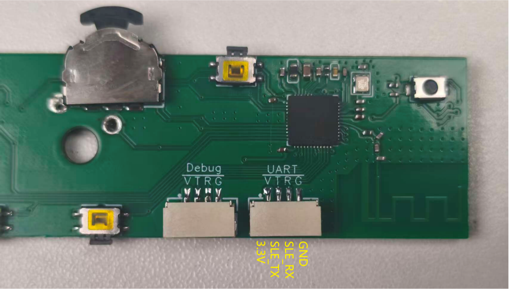
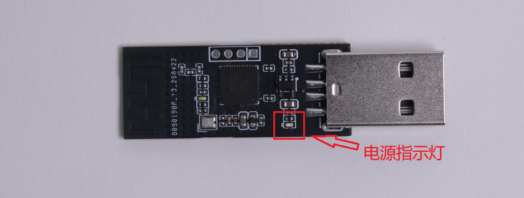
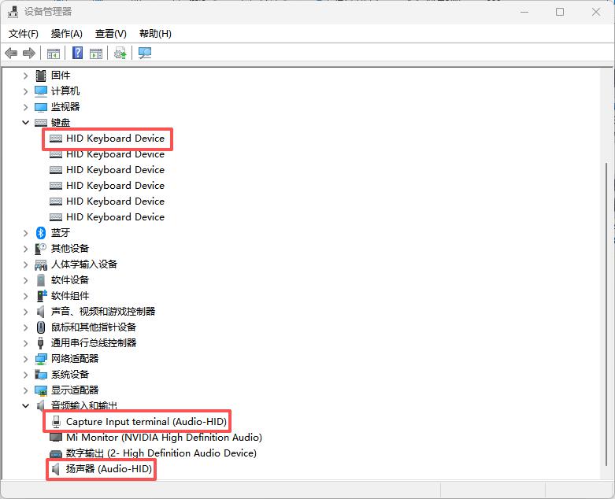
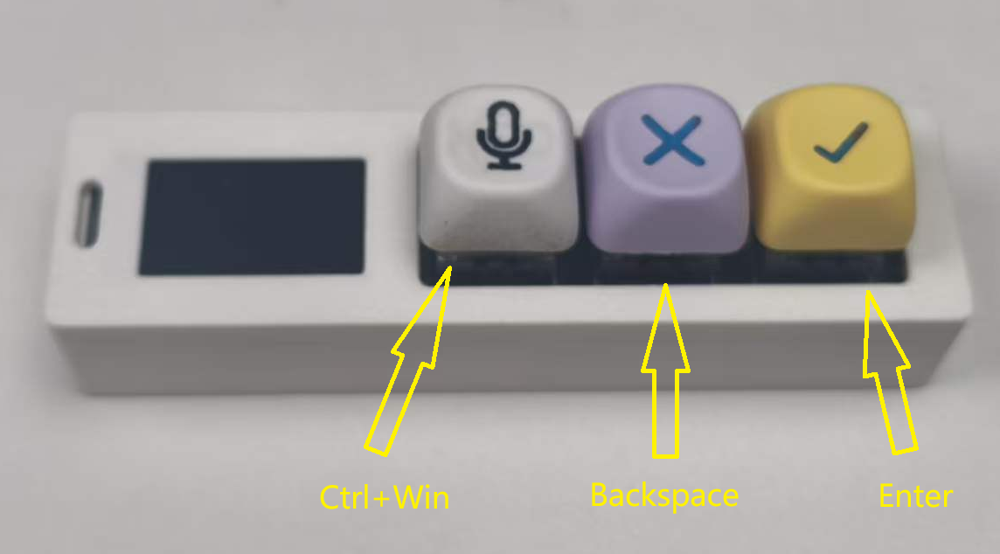
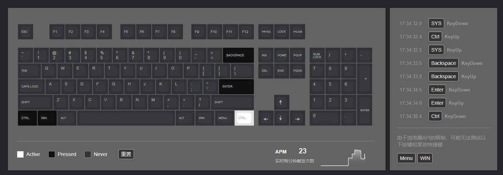
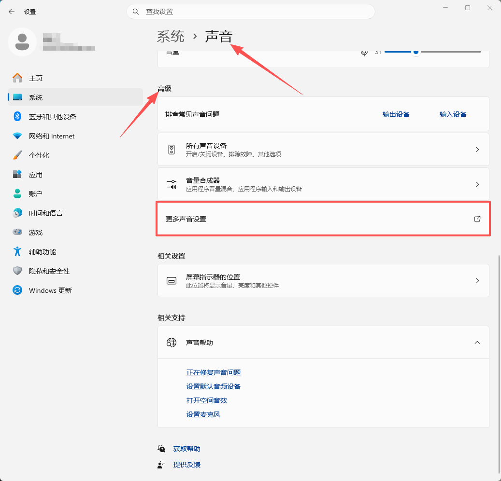
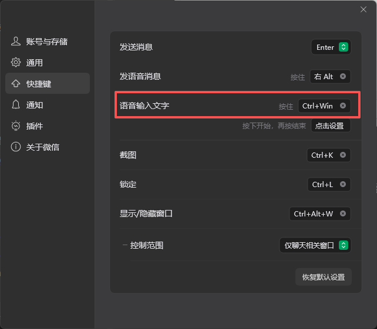
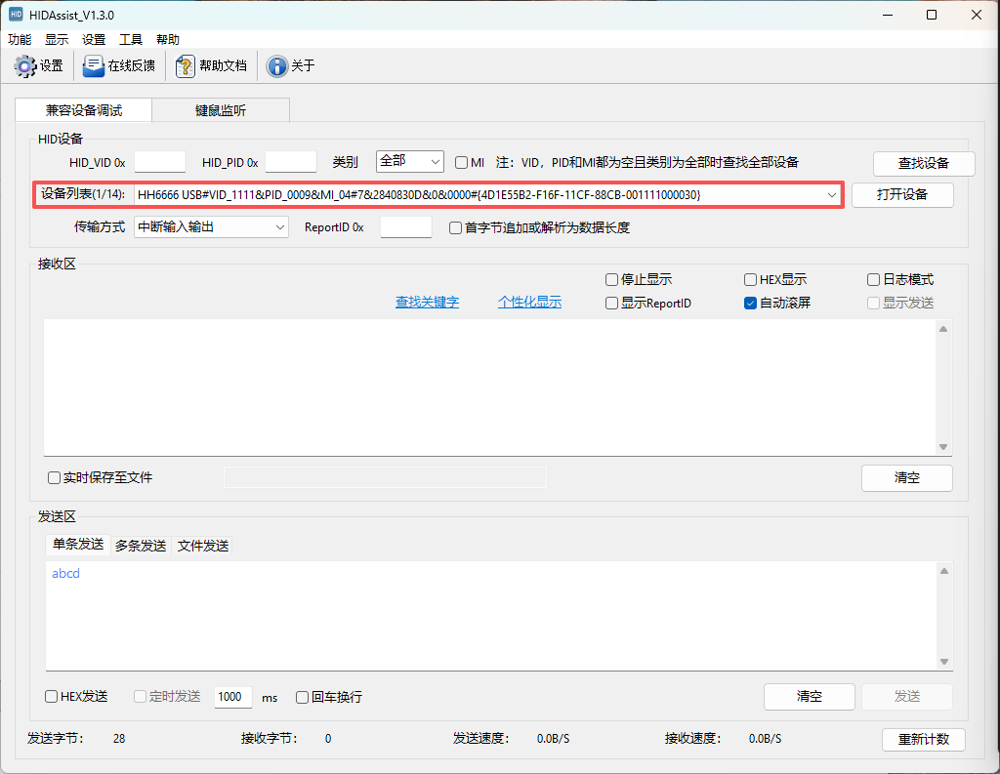

## 案例简介

Vibe_Coding_Keyboard 基于 BS21E 主控芯片、LiteOS 系统开发，依托星闪通信搭配 USB‑HID 实现全双工数据交互。设备配备语音输入、回车、回退三颗定制机械按键与 PDM数字麦克风，搭配 1.14 英寸 TFT 彩色显示屏，上行可无线传输按键指令与音频数据，下行接收电脑发送的状态信息并在彩屏上实时展示，专为开发者打造编码辅助工具。


## 功能特点


- 实时采集 PDM 麦克风音频通过星闪发送给USB_dongle同步传输给PC。
- 预设语音输入、回车、回退三键功能，直接生成标准键盘码指令，无需任何配置。
- 遵循标准 USB-HID 协议，无需安装驱动，即插即用。
- 接收并解析PC下发的claude code的状态信息，读取并展示在屏幕上。


## 目录结构
```
Vibe_Coding_Keyboard/
├── assets  
├── hardware    # 硬件文件 
├── software    # 软件固件  
└── README.md

```

## 固件烧录

### 硬件连接

#### USB-Dongle部分


使用下载调试模块按以下接线方式与USB-Dongle连接。

```
下载调试模块          USB-Dongle
3.3V-----------------3.3V
TX-------------------SLE_RX
RX-------------------SLE_TX
GND------------------GND
```

#### 键盘部分



使用下载调试模块按以下接线方式与键盘主体连接。

```
下载调试模块          USB-Dongle
3.3V-----------------3.3V
TX-------------------SLE_RX
RX-------------------SLE_TX
GND------------------GND
```

### 软件烧录

1、下载烧录工具

- 下载[BurnTool](https://gitee.com/hihope_iot/near-link/blob/master/tools/BurnTool_5.0.39.rar)工具，并压BurnTool压缩包。

2、进入BurnTool，点击“Setting”，波特率设置为750000。


3、选择端口，选择固件，并勾选“Auto burn”和“Auto disconnect”。


4、点击Connect，断开开发板连接的供电线，再重新连接开发板供电线，即可烧录固件。


## 功能调试

先将USB-Dongle插入PC的任意USB-A口，接收模块也对应接好5V电源，可看到下图标记位置的**电源指示灯**亮起。



打开电脑的设备管理器，在键盘一栏可以看到有增加一个HID Keyboard Device，在音频输入和输出一栏中有增加Audio-HID结尾的麦克风和扬声器，表示接收端设备已成功在PC上模拟出了HID设备，新增如下图所示。



### 键盘按键输入

1、拿出我们的键盘本体，上面有三个按键，从左到右依次表示为：Ctrl+Win，Backspace，Enter。



2、使用Type-c接口的供电线与键盘连接，打开[键盘测试](https://www.zfrontier.com/lab/keyboardTester)网页，我们随意按下这三个按键，可以看到网页上对应位置的按键变黑了，右边也出现了按键被按下的日志。



### 语音输入

1、使用Type-c接口的供电线与键盘连接，首先我们打开**设置**（快捷键win+i），进入系统->声音->高级->更多声音设置



2、在弹出的窗口中我们在最上面一栏中点击**录制**，在设备列表中找到带有**Audio-HID**的设备右键选择**属性**。

3、在弹出的窗口的最上面一栏选择侦听，勾选**侦听此设备**。


4、之后再进入到**高级**一栏中。选择默认格式为“**1通道，16位，16000HZ（磁带录像机音质）**”。


点击应用再点击确定即可。

5、登录微信，确保语音输入文字的快捷键是Ctrl+Win。



6、打开一个空白的word文档，按下第一个有麦克风标志的按键，随意说一段话，松开按键，就可以转文字到文档了。

### 屏幕状态显示

使用**HIDAssist**工具快速验证模块间的通信测试。

1、下载[HIDAssist](https://www.wch.cn/downloads/HIDAssist_ZIP.html)工具，并解压，压缩包内有详细的使用说明。

2、打开HIDAssist工具，点击设备列表，找到如下所示的设备，并连接设备。



3、在发送区输入以下内容，点击发送。

```

```


## 调试建议


