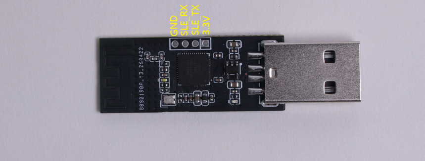

## 案例简介

Vibe_Coding_Keyboard 基于 BS21E 主控芯片、LiteOS 系统开发，依托星闪通信搭配 USB‑HID 实现全双工数据交互。设备配备语音输入、回车、回退三颗定制机械按键与 PDM数字麦克风，搭配 1.14 英寸 TFT 彩色显示屏，上行可无线传输按键指令与音频数据，下行接收电脑发送的状态信息并在彩屏上实时展示，专为开发者打造编码辅助工具。


## 功能特点


- 实时采集 PDM 麦克风音频通过星闪发送给USB_dongle同步传输给PC。
- 预设语音输入、回车、回退三键功能，直接生成标准键盘码指令，无需任何配置。
- 遵循标准 USB-HID 协议，无需安装驱动，即插即用。
- 接收并解析PC下发的claude code的状态信息，读取并展示在屏幕上。


## 目录结构
```
Vibe_Coding_Keyboard/
├── assets  
├── hardware    # 硬件文件 
├── software    # 软件固件  
└── README.md

```

## 固件烧录

### 硬件连接



使用下载调试模块按以下接线方式与USB-Dongle连接。

```

```

### 软件烧录

1、下载烧录工具

- 下载[BurnTool](https://gitee.com/hihope_iot/near-link/blob/master/tools/BurnTool_5.0.39.rar)工具，并压BurnTool压缩包。

2、进入BurnTool，点击“Setting”，波特率设置为750000。


3、选择端口，选择固件，并勾选“Auto burn”和“Auto disconnect”。


4、点击Connect，断开开发板连接的供电线，再重新连接开发板供电线，即可烧录固件。


## 功能调试


### 按键输入


### 语音输入


### 屏幕状态显示


## 调试建议


