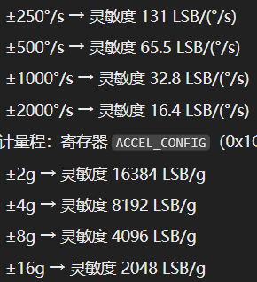

## 认识mpu6050

mpu6050是一个6轴的陀螺仪，它能够获取到当前的三轴加速度和三轴角速度，以及温度数据，那么拿到任意一个传感器的第一件事，肯定是想方法来获取传感器数据了，我们通过阅读文档可以知道，它是通过I2C通信的，那么我们拿出ESP32-S3，用claude code就可以帮我做好读取原始数据这个工作了，那在这之前该做好哪些配置工作呢。

## 读取原始数据前的配置

首先我们要对MCU的I2C进行初始化配置，需要配置好IO口和通信频率，之后我们要唤醒芯片，芯片默认是处于休眠状态的，然后就是芯片时钟源的配置了，默认是使用内部的RC振荡器，我们可以选择陀螺仪X轴PLL时钟，它的时钟精度更高，温漂更小，如果硬件设计中有加入外部晶振电路，也可以选择使用外部晶振。然后就是采样率的配置了，这里还是有些东西可以说道说道的，对于陀螺仪的而言，它最大能支持8KHz的采样频率，而加速度计则最大只能支持到1KHz的采样频率，这是硬件本身决定的。而采样率的大小也不一定是按照顶格进行配置的，比如我们在做平衡车、云台等需要高频控制的项目的时候，我们就需要更高的采样率来满足控制系统的高频需求，而如果是一些检测状态的项目并不需要我们频繁采集状态我们就可以调低我们的采样率。与采样率相关的还有一个参数就是DLPF(低通滤波配置)，当我们开启低通滤波后，陀螺仪的最高输出频率会被锁定在1KHz以下。这些都做完后就还剩下最后一个陀螺仪和加速度计量程的配置了，一般的陀螺仪和加速度计量程如下图所示

这些参数的意思是能够采集到的最大角速度和加速度，但这里有个细节要注意了，并不是量程越大越好，因为我们的寄存器大小只有16位，转换成十进制就是65535，因为还有正负之分，所以量程范围应当时+-32768。如果我们调大量程，就会导致我们的精度下降，所以量程的大小选择就要根据项目需求来做出对应调整，不能盲目选择大量程。

## 如何读取Gyroscope原始数据

最简单的办法就是从寄存器0X3B开始，顺序读取后面6个的寄存器值，然后依次对应加速度计 X 轴高字节、X 轴低字节、Y 轴高字节、Y 轴低字节、Z 轴高字节、Z 轴低字节，陀螺仪数据同理，它是从寄存器0X43开始往后顺序读取6个寄存器值，将每个轴的高低字节拼接为16位的有符号整数即为该轴的原始数据，这样就可以获取到陀螺仪和加速度计的所有原始数据了。

而主流的标准读取方法是通过配置MPU6050中断引脚，当Gyroscope完成一次完整的采样，INT引脚就会输出触发信号，MCU通过外部中断响应，在中断回调中读取这一帧的完整数据。

## 拿到Gyroscope原始数据能做什么

首先我们要知道我们拿到的原始数据是一串没有任何物理意义的数字，这时候我们就要通过下面这个公式将其转换成物理角速度和加速度。

	真实角速度 (°/s) = 原始 ADC 值 / 灵敏度系数
	真实加速度 (g) = 原始 ADC 值 / 灵敏度系数

各量程的灵敏度系数可以在数据手册（12页）中的这里找到。假设我们配置角速度量程是+-2000°/s，读取到的原始数据为1640，这时候真实角速度 = 1640 / 16.4 = 100 °/s，即Gyroscope沿着轴正方向以每秒 100 度旋转，真实加速度值同理。

如果成功读取到原始数据并转换成真实物理量，你会发现，明明陀螺仪没有动，为什么会有一个固定的角速度在输出呢，这是因为MEMS陀螺仪会存在固有的零点偏移——零偏。

要解决零偏也不难，保持Gyroscope绝对静止，连续采样几百个数据，取平均后就是零偏值，这时候我们每次读取到数据后讲原始数据减去零偏值，就完成了零偏校准的工作了。

