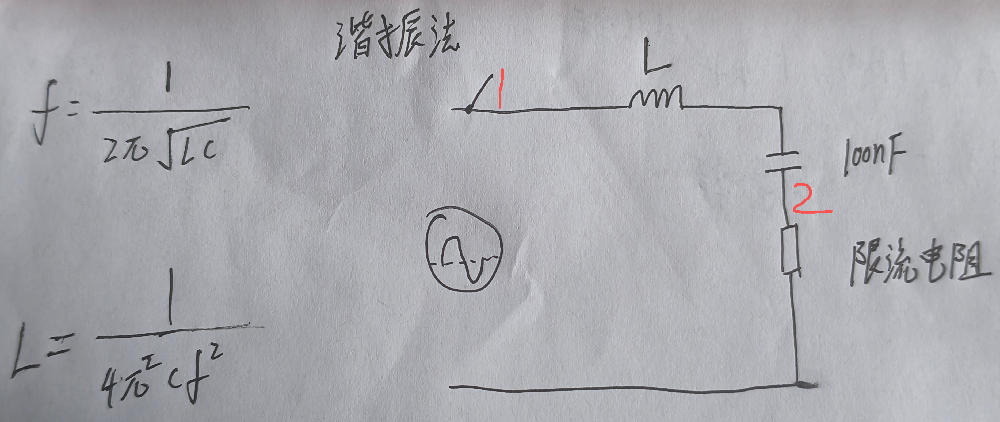

## 什么是库仑计

采集型电池电量表，能实时采集电池组的电压、电流、功率、真实电量、剩余使用时间、充电时间、容量统计。

### 有什么用

最开始库仑计的作用只是统计电池的电荷量，随着应用需求的增加，才添加了更多的信息。（可以把库仑计理解为家里的水表，就是来检测用了多少电的）

### 常见的库仑计有什么功能

```
1、电量显示
2、电池容量检测
3、电流检测
4、电压检测
5、实时功率检测
6、充放电检测

```


## 如何测量电阻、电容、电感值

### 电阻

#### 基础测量方法

使用万用表调整到电阻档，直接接在要测量电阻的两端，对于百欧以上的电阻值测量是没问题的，但如果阻值很小，这时候就需要考虑表笔自身电阻和接触电阻对阻值测量产生的影响了，

#### 四线开尔文测量法


### 电容：


### 电感：谐振法



使用信号发生器产生正弦波，示波器分别测量1点和2点，通过调节正弦波的频率让两个测试点位的相位相同，带入左边公式，知道了电容的容值和正弦波频率就可以计算出所测电感的感值了。


