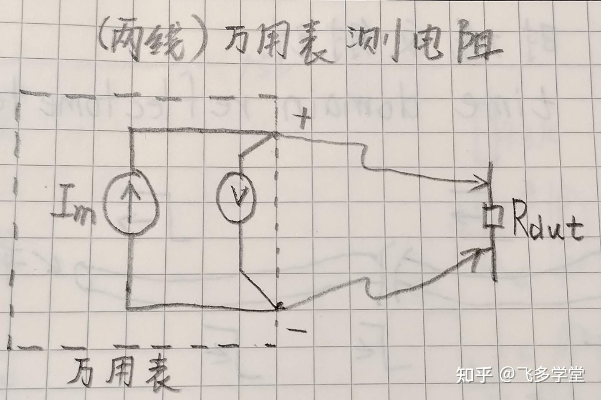
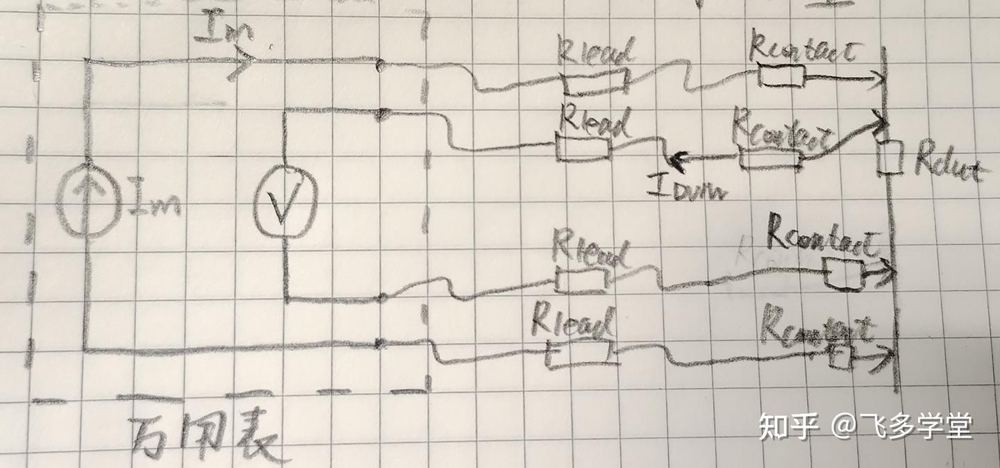
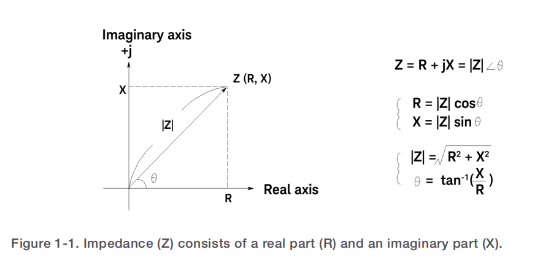
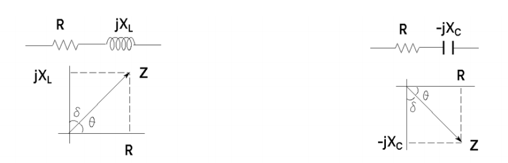
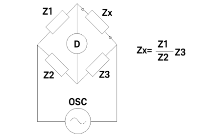
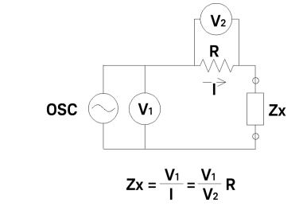
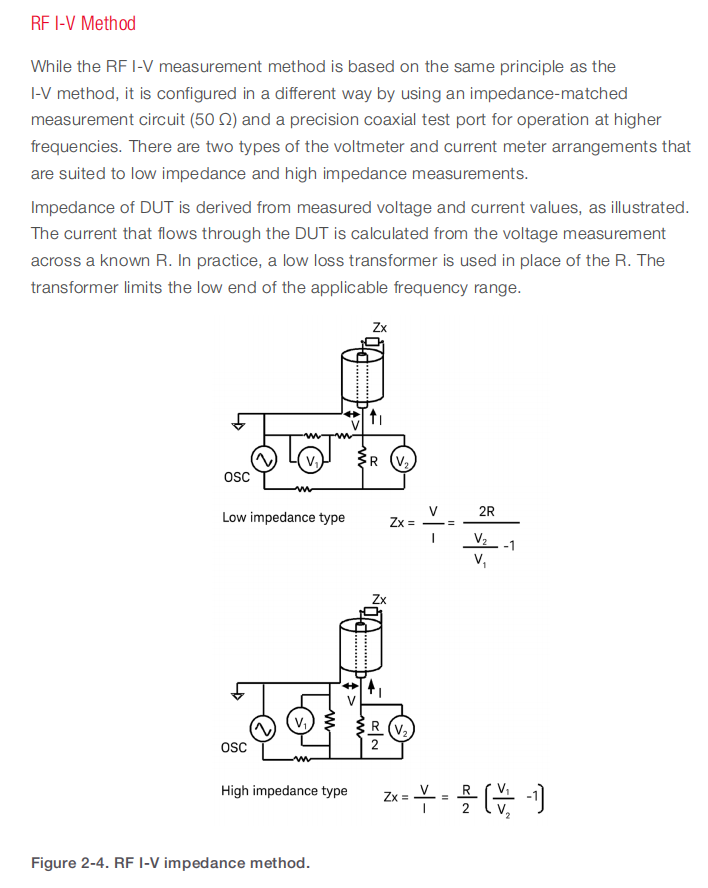
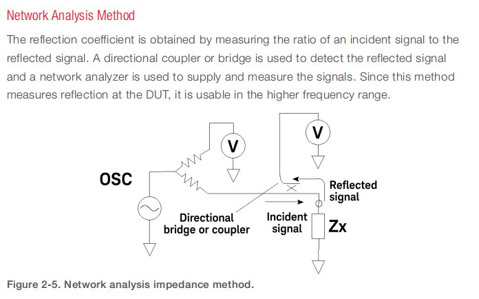
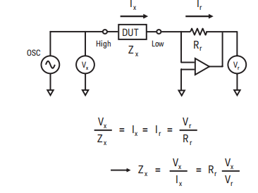
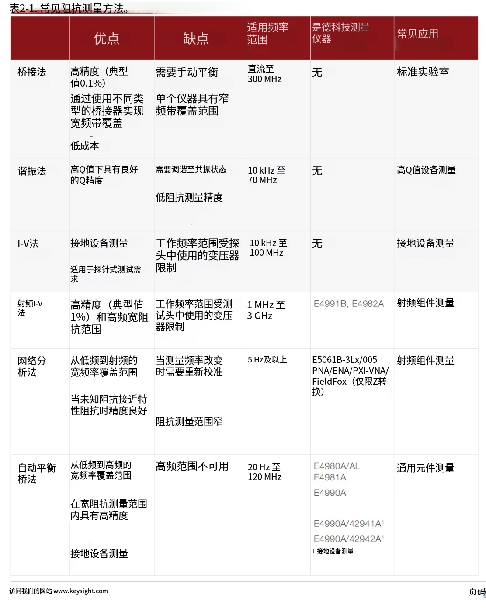

## 电阻

#### 基础测量方法

使用万用表调整到电阻档，直接接在要测量电阻的两端，对于百欧以上的电阻值测量是没问题的，但如果阻值很小，这时候就需要考虑表笔自身电阻和接触电阻对阻值测量产生的影响了。

## 电感：谐振法

使用信号发生器产生固定频率的正弦波，示波器分别测量1点和2点，通过调节正弦波的频率让两个测试点位的相位相同，带入左边公式，知道了电容的容值和正弦波频率就可以计算出所测电感的感值了。

# 如何测量电阻、电容、电感

这个是一个电阻（色环或0805这样），这是一个电容（铝点解电容），而这是一个电感（带有数据的功率电感），这些元器件的参数都可以通过元器件上的标签看到，那这些呢（0402电阻，mlcc电容，手绕的电感什么的），这时候就有人说了可以使用万用表来测量呀，确实我们可以使用万用表的电阻档和电容档轻松测出数据，但是，当电阻值开始小于100欧姆的时候，可以看到它的偏差开始变得越来越大了，为什么会出现这种现象呢。这是接触电阻在影响着测量精度，当测量电阻很大的时候，接触电阻被淹没在了数据中没有凸显出来，但当测量电阻比较小的时候，测量电阻的阻值就开始显现了，我们可以使用四线开尔文测量法来测试，就可以避免引入接触电阻的干扰了，四线开尔文法是用电流和压差来计算出阻值的，所以这种方法天然就可以避免接触电阻带来的干扰。

### 四线开尔文测量法

四线测电阻法将输出电流的走线和读取待测电阻两端电压值的引线分开。所谓四线，其中有两根是提供恒定电流的，另外两根是测量待测电阻两端电压的，其中Rlead是自身电阻，Rcontact是接触电阻。

电容的话一般的万用表也有这个挡位，那电感呢，这时候我们就要借助另外一个测量仪器，LCR电桥（希望能借一个电桥做演示用）。那电桥的使用也非常简单，只需要。。。

在讲电桥的原理之前有一个你可能听说过但一直没有搞懂的专业名词——**阻抗**。那什么是阻抗呢。

## 阻抗

电路中在特定频率下对交流电流所呈现的总阻碍作用，以复数的形式呈现。

Z=R+JX

阻抗 Z 由实部电阻 R 与虚部电抗 X 组合而成；其中电抗为储能元件带来的相位分量，正值代表感抗、负值代表容抗。实部R对应器件的等效串联电阻 ESR。

理论上来讲是这样的，给元件通入一个**已知角频率 ω** 的正弦信号，同时测出它两端电压和流过电流的**幅值比**和**相位差θ**，就能得到：

$$ Z=\frac{U}{I}\angle\theta=|Z|\cos\theta+j|Z|\sin\theta $$

其中$R = |Z|\cos\theta X = |Z|\sin\theta$

如果X>0,呈感性，测量的就是电感

$$ L=\frac{X}{2\pi f} $$

如果X<0,呈容性，测量的就是电容

$$ C=\frac{1}{2\pi f\cdot|X|} $$

## 如何测量阻抗

### 1、电桥法(惠斯通电桥)

通过不断调节三个标准电阻、电容、电感的参数，直到中间检测器D没有电流流过，就达到了电桥平衡，通过公式就可算出待测元件的阻抗了

### 2、谐振法

使用信号发生器产生固定频率的正弦波，示波器分别测量1点和2点，通过调节正弦波的频率让两个测试点位的相位相同，带入左边公式，知道了电容的容值和正弦波频率就可以计算出所测电感的感值了。

### 3、I-V法

按照上面这个样子搭建电路，Zx是待测器件，V1是待测器件电压，V2是采样电阻电压，我们需要给电路接入一个正弦信号源，通过看V1和V2的相位来判断待测器件是电容还是电感，之后通过图片下面的公式就可以知道Zx的阻抗，之后运用$L=\frac{X}{2\pi f}$和$C=\frac{1}{2\pi f\cdot|X|}$公式就可以计算得出电感电容值。
### 4、RF I-V法

没看懂图，也没在网上找到资料

### 5、网络分析法

没看懂图，也没在网上找到资料

### 6、自动电桥法

测试

阻抗

## LCR电桥设计

自由轴法、FFT、LMS、DLIA

### 阻抗

输入交流频率小于100k才能使用自由轴法

