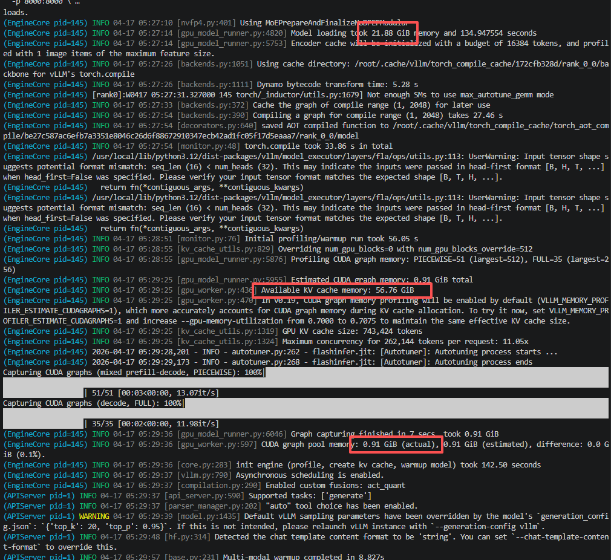

https://developer.nvidia.cn/blog/inside-nvidia-blackwell-ultra-the-chip-powering-the-ai-factory-era/#:~:text=%E8%B6%85%E5%BC%BANVFP4%20%E6%80%A7%E8%83%BD.%20Blackwell%20GPU%20%E6%9E%B6%E6%9E%84%E5%BC%95%E5%85%A5%E4%BA%86%E5%85%A8%E6%96%B0%E7%9A%844%20%E4%BD%8D%E6%B5%AE%E7%82%B9%E6%A0%BC%E5%BC%8FNVIDIA%20NVFP4%EF%BC%8C%E8%AF%A5%E6%A0%BC%E5%BC%8F%E7%BB%93%E5%90%88%E4%BA%86%E5%8F%8C%E7%BA%A7%E7%BC%A9%E6%94%BE%E6%9C%BA%E5%88%B6%EF%BC%9A%E9%92%88%E5%AF%B916,%E5%80%8D%EF%BC%8C%E8%BE%83NVIDIA%20Hopper%20H100%20%E5%92%8CH200%20GPU%20%E6%8F%90%E5%8D%87%E9%AB%98%E8%BE%BE7.5%20%E5%80%8D%E3%80%82%E8%BF%99%E4%B8%80%E6%80%A7%E8%83%BD%E6%8F%90%E5%8D%87%E6%98%BE%E8%91%97%E5%A2%9E%E5%BC%BA%E4%BA%86%E5%A4%A7%E8%A7%84%E6%A8%A1%E6%8E%A8%E7%90%86%E8%83%BD%E5%8A%9B%EF%BC%8C%E6%94%AF%E6%8C%81%E6%9B%B4%E5%A4%9A%E7%9A%84%E5%B9%B6%E5%8F%91%E6%A8%A1%E5%9E%8B%E5%AE%9E%E4%BE%8B%EF%BC%8C%E5%AE%9E%E7%8E%B0%E6%9B%B4%E5%BF%AB

docker run -it --rm -p 3000:8080 --add-host=host.docker.internal:host-gateway -v open-webui:/app/backend/data ghcr.io/open-webui/open-webui:main

docker run -it --rm \
  --gpus all \
  --ipc host \
  --shm-size 16G \
  -p 8000:8000 \
  -v ~/.cache/huggingface:/root/.cache/huggingface \
  vllm/vllm-openai:latest-cu130-ubuntu2404 \
    --enable-prefix-caching \
    --moe-backend marlin \
    --max-model-len 262144 \
    --gpu-memory-utilization 0.7 \
    --enable-auto-tool-choice \
    --reasoning-parser qwen3 \
    --tool-call-parser qwen3_coder \
    --host 0.0.0.0 \
    --port 8000 \
    apolo13x/Qwen3.5-35B-A3B-NVFP4

docker run -it --rm \
  --gpus all \
  --ipc host \
  --shm-size 16G \
  -p 8000:8000 \
  -v ~/.cache/huggingface:/root/.cache/huggingface \
  vllm/vllm-openai:latest-cu130-ubuntu2404 \
    --enable-prefix-caching \
    --max-model-len 262144 \
    --gpu-memory-utilization 0.7 \
    --enable-auto-tool-choice \
    --reasoning-parser qwen3 \
    --tool-call-parser qwen3_coder \
    --host 0.0.0.0 \
    --port 8000 \
    AxionML/Qwen3.5-0.8B-NVFP4

https://github.com/KMnO4-zx/huanhuan-chat

https://huggingface.co/apolo13x/Qwen3.5-35B-A3B-NVFP4

docker run -it --rm \
  --gpus all \
  --ipc host \
  --shm-size 16G \
  -p 8000:8000 \
  -v ~/.cache/huggingface:/root/.cache/huggingface \
  vllm/vllm-openai:latest-cu130-ubuntu2404 \
    --gpu-memory-utilization 0.7 \
    --host 0.0.0.0 \
    --port 8000 \
    Qwen/Qwen3.5-0.8B

hf download \ --local-dir ./my_model \ google/gemma-4-E4B-it

hf download \ --local-dir ./my_model \ Jackrong/Qwen3.5-9B-GLM5.1-Distill-v1-GGUF

echo "hf download \ --local-dir ./my_model \ google/gemma-4-E4B-it" > filename.txt

echo "hf download \ --local-dir ./my_model \ Jackrong/Qwen3.5-9B-GLM5.1-Distill-v1-GGUF" > filename.txt

